# Amt24 - Blaupause-Prozess

<!-- TOC start (generated with https://github.com/derlin/bitdowntoc) -->

- [Amt24 - Blaupause-Prozess](#amt24---blaupause-prozess)
    * [Funktionsumfang](#funktionsumfang)
    * [Erstellen eines Blaupause-Prozesses](#erstellen-eines-blaupause-prozesses)
        + [Voraussetzungen](#voraussetzungen)
        + [Formular einrichten](#formular-einrichten)
        + [Neuen Prozess mit Blaupauseassistent erstellen](#neuen-prozess-mit-blaupauseassistent-erstellen)
    * [Prozess testen](#prozess-testen)
    * [Prozess allen Nutzern verfügbar machen](#prozess-allen-nutzern-verfügbar-machen)
        + [Formular zertifizieren](#formular-zertifizieren)
        + [Übertragung auf das Live-System](#übertragung-auf-das-live-system)
        + [Prozess auffindbar machen](#prozess-auffindbar-machen)
    * [Weitere Hilfe](#weitere-hilfe)

<!-- TOC end -->

Der Blaupause-Prozess ist eine Vorlage, mit der Kommunen, Landratsämter, Ministerien und andere öffentliche
Einrichtungen möglichst schnell und einfach ihre Anträge auf Amt24 bereitstellen können. Seine Verwendung richtet sich
dabei auch speziell an Personen, die noch keine Erfahrung in der Prozessmodellierung haben oder nur die
Formular-Funktion von Amt24 verwenden möchten.

## Funktionsumfang

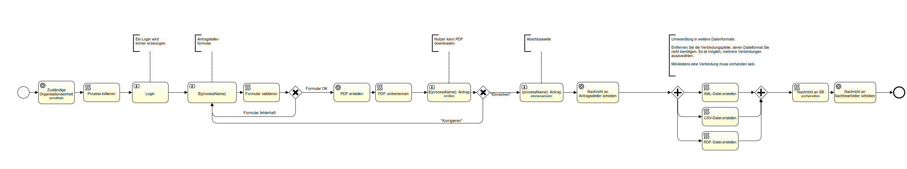

Der Blaupause-Prozess durchläuft nach seiner Konfiguration durch die Modellierenden diese Schritte:

1. Bestimmung des zuständigen Sachbearbeiters / Behördenkontos (anhand der konfigurierten Organisationseinheit).
1. Login des Antragsstellers mit einem Amt24-Servicekonto.
1. Ausfüllen eines konfigurierbaren Formulars, inkl. Validierung.
1. Umwandlung des Formulars in eine PDF-Datei.
1. Anzeige einer Zusammenfassungsseite, auf der die PDF-Datei geprüft werden kann.
1. "Antrag eingereicht" Nachricht an Servicekonto der Antragsstellenden.
1. Umwandlung in ein konfigurierbares Datenformat für die Sachbearbeitung. Die modellierende Person wählt dabei
   zwischen:
    1. XML
    1. CSV
    1. PDF
1. "Antrag eingegangen" Nachricht an das hinterlegte Postfach der Organisationseinheit mit den gewählten Datenformaten.

## Erstellen eines Blaupause-Prozesses

Um den Blaupause-Prozess zu nutzen und auf Ihre Anforderungen anzupassen, müssen Sie folgende Punkte durchführen.

### Voraussetzungen

* Sie haben Zugriff auf das AdminCenter des Amt24-Entwicklungssystem https://admincenter.amt24dev.sachsen.de.
    * Sie sind dort für Ihren gewünschten Mandanten (d. h. Ihre Kommune/Landratsamt/Behörde) freigeschaltet.
    * Sie sind den Benutzergruppen `Mandantenredakteur Behörden und Zuständigkeiten` und `Prozessassistent - Nutzer`
      zugeordnet

* In Ihrem gewünschten Mandanten sind die Daten zum Bild, Datenschutzbeauftragten und zum Impressum gepflegt:
  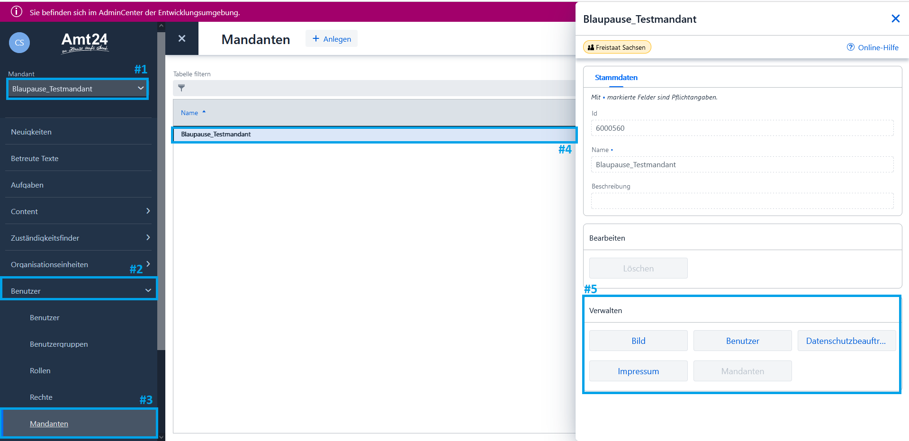

* Es existiert bereits ein Behörden- oder Organisationskonto, welches die Antragsdaten empfangen soll.

* Es existiert bereits eine Organisationseinheit, die für die Verarbeitung der Antragsdaten zuständig ist.

    * Diese Organisationseinheit hat eine "Kommunikation" mit dem Kanal "Servicekonto" gepflegt, welches auf das obige
      Behörden-/Organisationskonto verweist:
      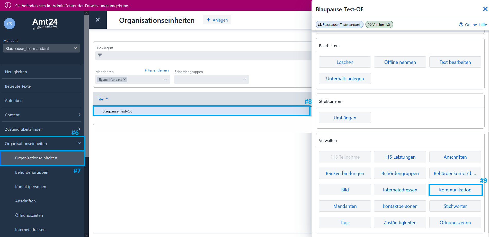

      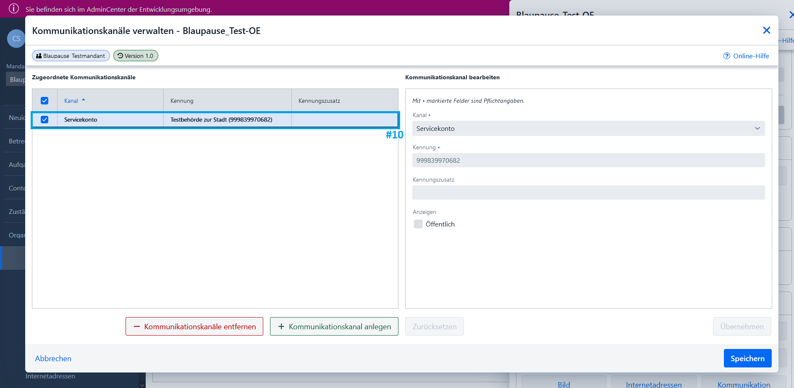

* Es existiert bereits eine Leistung, in deren Kontext der Prozess aufrufbar sein soll.

    * Die Leistung hat eine "Zuständigkeit" gepflegt, welche die obige Organisationseinheit referenziert.
      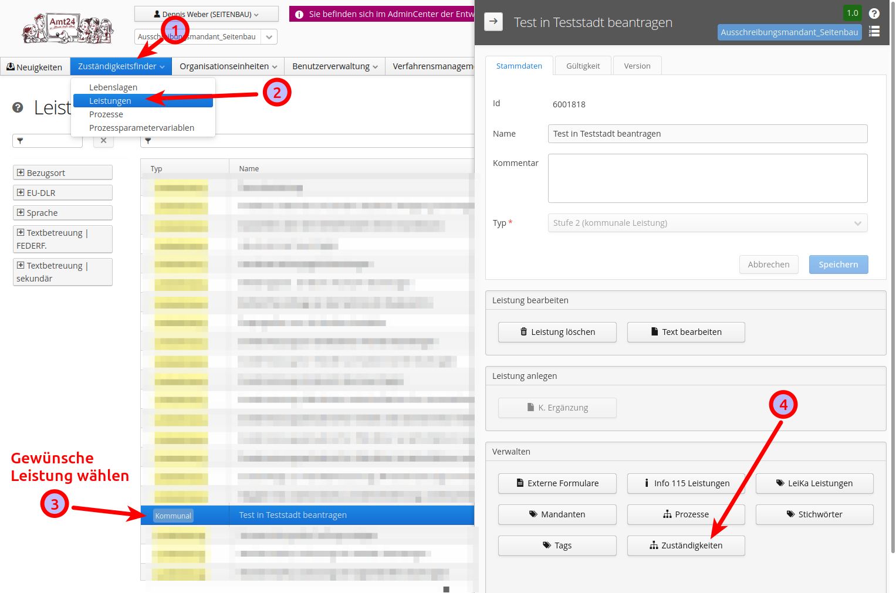

Detaillierte Informationen, wie ein Blaupause-Prozess das Behörden/Organisationskonto bestimmt, finden Sie
im [User Guide: Bestimmung des zuständigen Sachbearbeiters](./User_Guide_Bestimmung_zustaendiger_Sachbearbeiter.md)

### Formular einrichten

Der Blaupause-Prozess erwartet exakt ein Formular, das dem Antragstellenden zum Ausfüllen angeboten wird.

Falls Sie noch kein solches Formular haben, empfehlen wir
Ihnen, [diese Vorlage](./Modelliergruppe_Prozessname_ApplicantForm-v1.0-de.json) zu verwenden. Gehen Sie dazu
folgendermaßen vor:

1. Laden Sie die `.json`-Datei auf Ihre Festplatte herunter. (Auf GitHub können Sie mit einem Rechtsklick auf den `Raw`
   Button die Option `Ziel speichern unter...` wählen.)
1. Melden Sie sich im AdminCenter an und erstellen Sie dort ein neues Formular:
   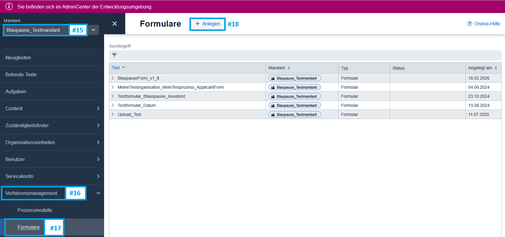
1. Vergeben Sie einen Formularnamen. Wir empfehlen, dass dieser aus 3 Komponenten besteht, getrennt durch einen
   Underscore `_`.
    1. Ihre Organisation
    1. Dem Namen des Prozesses
    1. Einer Bezeichnung, dass es sich hierbei um das Antragstellendenformular (und nicht z. B. um ein Prüfformular, oder
       das Formular der Sachbearbeitung handelt).
    1. z. B. `LandesdirektionSachsen_Landarztgesetz_ApplicantForm`
1. Laden Sie die `.json` Datei hoch:
   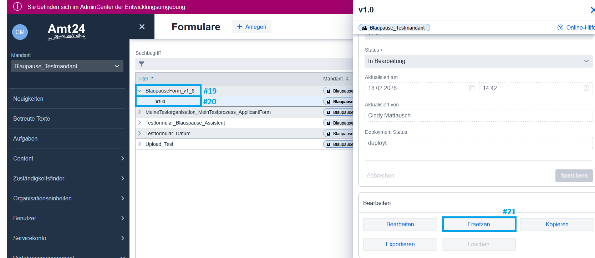
   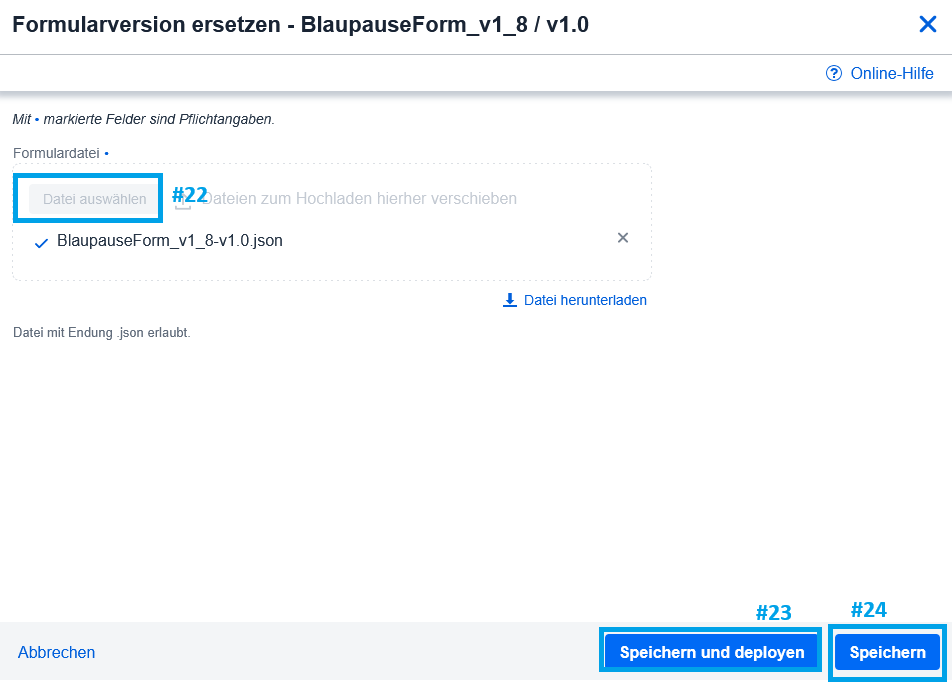
1. Sie können das Formular nun über den `Datei bearbeiten` Button bearbeiten.
    * Eine Anleitung zum Erstellen von Formularen ist nicht Bestandteil dieses Dokuments. Falls Sie dazu weitere Hilfe
      benötigen, siehe [weitere Hilfe](#weitere-hilfe).
    * Falls Sie später eine Datenübertragung als XML-Datei beabsichtigen: Beachten Sie bitte, dass Sie für das `ID`
      Attribut eines jeden Formularfelds und jeder Formulargruppe einen sprechenden Namen verwenden und nicht die
      automatisch generierten IDs benutzten. Die sprechenden Namen müssen
      den [XML-Element Namensregeln](https://stackoverflow.com/a/31130882) entsprechen. Wir empfehlen die Verwendung
      von camelCase.

Falls Sie bereits ein Formular erstellt haben oder nicht die Vorlage nutzen möchten, prüfen Sie bitte, ob eine
eingehende und ausgehende Anbindung an die Prozessinstanzvariable `applicantForm` besteht (in dieser Variable erwartet
der Prozess die Formulardaten). Sie können dies im Formulardesigner sehen, nachdem Sie das oberste Element angeklickt
haben:

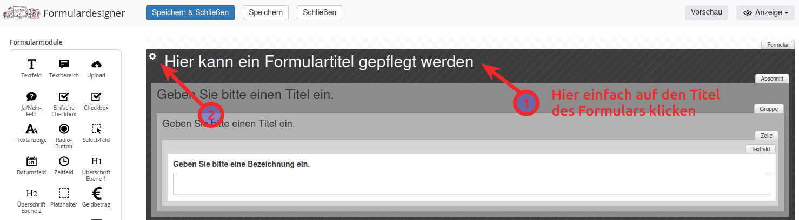

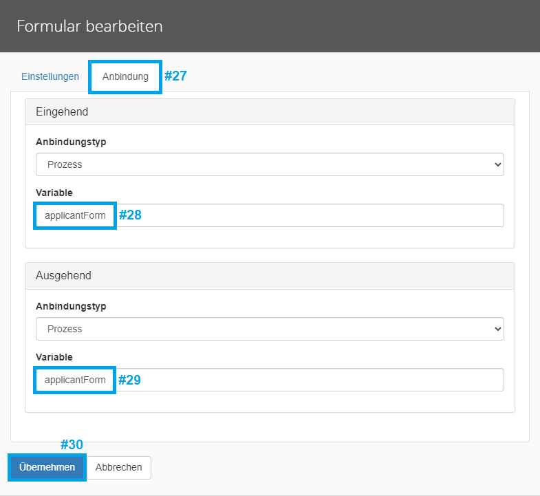

Zuletzt müssen Sie sicherstellen, dass das Formular deployt ist:

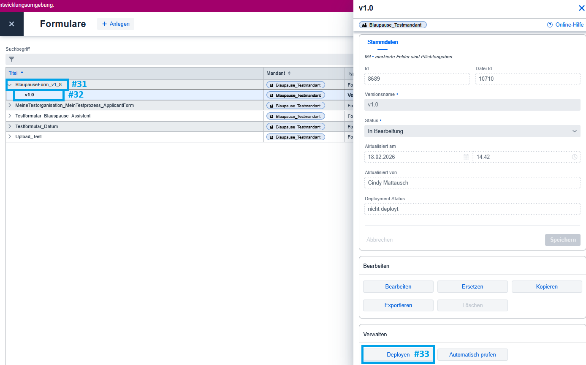

### Neuen Prozess mit Blaupauseassistent erstellen

Starten Sie nun der Blaupauseassistenten über den entsprechenden Button:

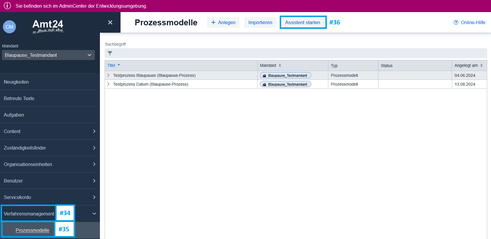

Sie werden nun erneut zum Login aufgefordert. Geben Sie dabei die gleichen Zugangsdaten ein, mit denen Sie sich auch ins
AdminCenter angemeldet haben. Anschließend wird Sie der Assistent durch die benötigten Schritte führen. Bitte beachten
Sie, dass Sie den Assistenten innerhalb von 8 Stunden durchlaufen haben müssen (falls Sie dieses Limit überschreiten,
können Sie den Assistenten aber einfach erneut starten).

## Prozess testen

Aktivieren und verbinden Sie Ihren Prozess mit der erstellten Leistung:

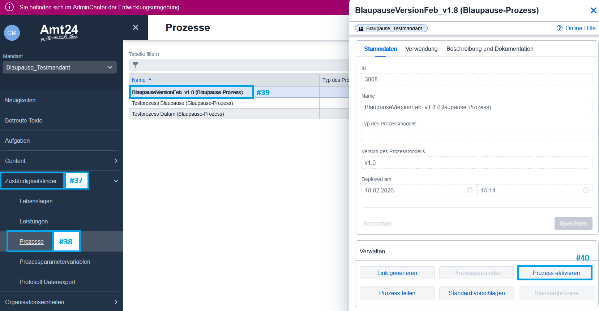

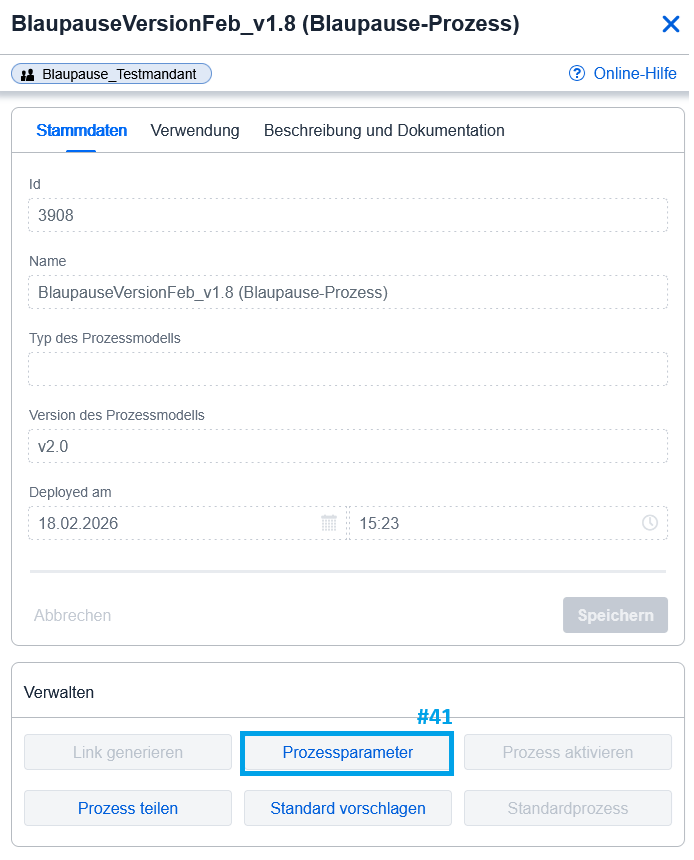

Ihr Prozess kann nun auf der Entwicklungsumgebung aufgerufen werden. Öffnen Sie
das [Amt24-Dev-System](https://amt24dev.sachsen.de) und suchen Sie nach Ihrem Prozess. Falls Sie in den
Zuständigkeiten (siehe Abschnitt [Voraussetzungen](#voraussetzungen)) einen Ort eingeschränkt haben, geben Sie auch
diesen bei der Suche an.

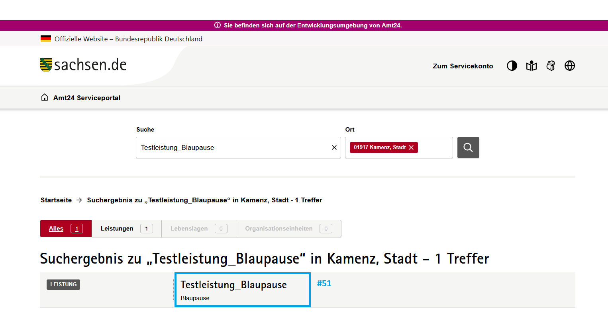

Starten Sie den Prozess über den blauen Button. Beachten Sie, dass es einige Zeit (i.d.R. 0 - 15 Minuten) dauern kann,
bis der Button angezeigt wird.

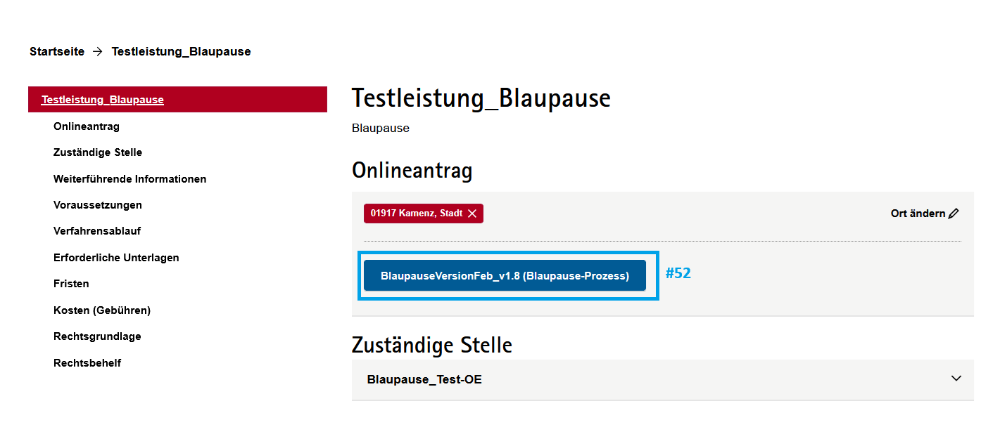

Falls Sie auf Fehlermeldungen wie `Die Liste der Aufgaben konnte nicht abgerufen werden.` stoßen, öffnen Sie wieder das
AdminCenter und prüfen Sie die Prozesslogs. Die dort stehenden Fehlermeldungen helfen Ihnen eventuell bei der
Fehlersuche:

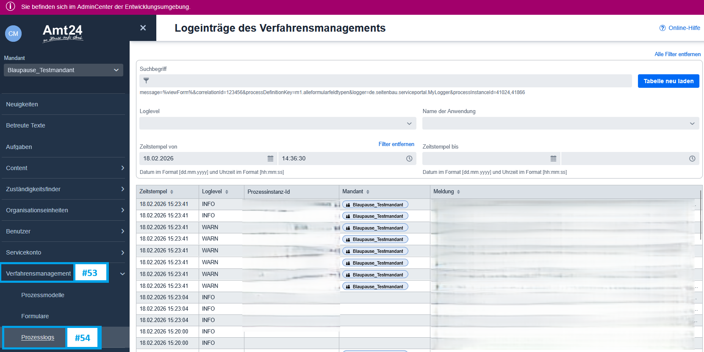

Testen Sie Ihren Prozess nun gut und ausführlich. Eventuell möchten Sie auch Ihre Kolleg*innen oder auch Bürger*innen um
Feedback bitten.

## Prozess allen Nutzern verfügbar machen

### Formular zertifizieren

Wenn Sie an Ihrem Formular keine Änderungen mehr durchführen möchten, können Sie es automatisch zertifizieren. Dieser
Schritt ist notwendig, da alle Formulare, die auf das Amt24 Livesystem übertragen werden, zuvor geprüft werden müssen.

Bei dieser automatischen Zertifizierung werden strengere Kriterien angelegt, als bei der "normalen Zertifizierung", die
Sie z. B. von anderen Prozessen kennen. Falls Ihr Formular diese Kriterien bereits erfüllt wird es direkt zertiziert.
Andernfalls erhalten Sie eine entsprechende Fehlermeldung, welche die notwendigen Anpassungen beschreibt.

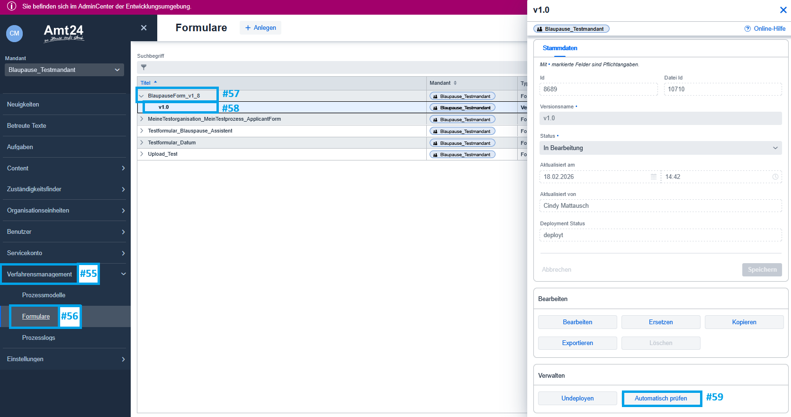

### Übertragung auf das Live-System

Als nächstes schicken Sie dazu eine Mail mit der Bitte zur
Übernahme des Prozesses auf das Produktivsystem an die
SID: [servicedesk@sid.sachsen.de](mailto:servicedesk@sid.sachsen.de). Nennen Sie dabei bitte Ihren Mandanten, den Namen
des Prozesses sowie den Namen Ihres Formulars.

### Prozess auffindbar machen

Nachdem Ihr Prozess durch die SID auf das Live-System übertragen wurde, können Sie ihn aktivieren und damit allen
Nutzenden verfügbar machen. Gehen Sie dazu genau wie im [Prozess testen](#prozess-testen) Abschnitt vor (nur dieses Mal
auf dem Amt24-Livesystem).

Herzlichen Glückwunsch, Sie haben nun alle Schritte durchgeführt und einen wichtigen Teil zur Digitalisierung der
öffentlichen Verwaltung beigetragen! 🥳

## Weitere Hilfe

Wenn Sie Fragen rund um die Nutzung der Blaupause und des Blaupause-Assistenten haben, wenden Sie sich bitte an die 
Amt24-Anwendungsbetreuung unter servicedesk@sid.sachsen.de. Auch SEITENBAU bietet (kostenpflichtige) Unterstützung bei 
individuellen Fragen zur Modellierung und zum Formulardesign. Ebenfalls werden Schulungen und die Umsetzung kompletter 
Anträge angeboten. Bei Interesse können Sie eine Mail an public-service@seitenbau.com schicken.

## Changelog

Alle Änderungen und die Versionen des Blaupause-Assistenten finden Sie im [Changelog](Changelog.md)
