# Blaupause-Prozess

<!-- TOC start - https://derlin.github.io/bitdowntoc/ -->

- [Funktionsumfang](#funktionsumfang)
- [Einrichten & Anpassen des Prozesses](#einrichten--anpassen-des-prozesses)
  - [Voraussetzungen](#voraussetzungen)
  - [Formular einrichten](#formular-einrichten)
  - [Neuen Prozess in Amt24 einrichten](#neuen-prozess-in-amt24-einrichten)
  - [Prozess-ID anpassen](#prozess-id-anpassen)
  - [Prozessname anpassen](#prozessname-anpassen)
  - [Referenziertes Formular anpassen](#referenziertes-formular-anpassen)
  - [Datenformat auswählen](#datenformat-auswählen)
  - [Deployen](#deployen)
- [Prozess testen](#prozess-testen)
- [Vorbereitung zur Übertragung auf das Live-System](#vorbereitung-zur-übertragung-auf-das-live-system)
  - [Prozessparameter](#prozessparameter)
  - [Datenschutzerklärung](#datenschutzerklärung)
  - [Zertifizierung](#zertifizierung)
  - [Übertragung auf das Live-System](#übertragung-auf-das-live-system)
- [Weitere Hilfe](#weitere-hilfe)

<!-- TOC end -->

Der Blaupause-Prozess ist eine Vorlage, mit der Kommunen, Landratsämter, Ministerien und andere öffentliche Einrichtungen möglichst schnell und einfach ihre Anträge auf Amt24 bereitstellen können. Seine Verwendung richtet sich dabei auch speziell an Personen, die noch keine Erfahrung in der Prozessmodellierung haben oder nur die Formular-Funktion von Amt24 verwenden möchten.

## Funktionsumfang

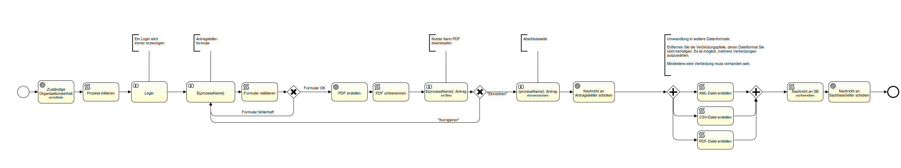

Der Blaupause-Prozess durchläuft nach seiner Konfiguration durch die Modellierer diese Schritte:

1. Bestimmung des zuständigen Sachbearbeiters / Behördenkontos (anhand der konfigurierten Organisationseinheit).
1. Login des Antragsstellers mit einem Amt24-Servicekonto.
1. Ausfüllen eines konfigurierbaren Formulars, inkl. Validierung.
1. Umwandlung des Formulars in eine PDF-Datei.
1. Anzeige einer Zusammenfassungsseite, auf der die PDF-Datei geprüft werden kann.
1. "Antrag eingereicht" Nachricht an Servicekonto des Antragsstellers.
1. Umwandlung in ein konfigurierbares Datenformat für die Sachbearbeitung. Die modellierende Person wählt dabei zwischen:
   1. XML
   1. CSV
   1. PDF
1. "Antrag eingegangen" Nachricht an Servicekonto des zuständigen Sachbearbeiters mit den gewählten Datenformat.

## Einrichten & Anpassen des Prozesses

Um den Blaupause-Prozess zu nutzen und auf Ihre Anforderungen anzupassen, müssen Sie folgende Punkte durchführen.

### Voraussetzungen

* Sie haben Zugriff auf das Admincenter des Amt24-Entwicklungssystem https://admincenter.amt24dev.sachsen.de.
  * Sie sind dort für Ihren gewünschten Mandanten (i.e. Ihre Kommune/Landratsamt/Behörde) freigeschaltet.
  * Sie sind der Benutzergruppe `Prozess- und Formularmodellierer` zugeordnet.

* In Ihrem gewünschten Mandanten sind die Daten zum Bild, Datenschutzbeauftragten und zum Impressum gepflegt:
  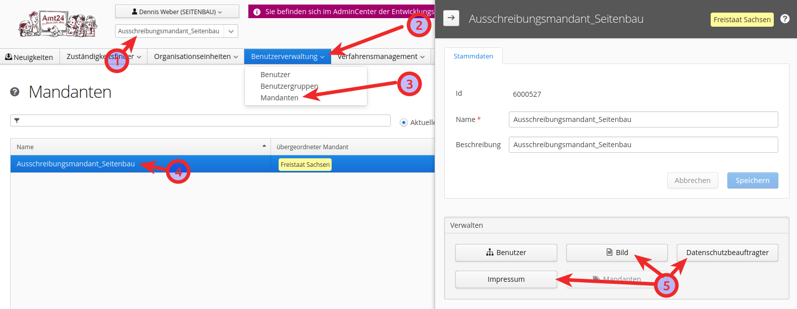

* Es existiert bereits ein Behörden- oder Organisationskonto, welches die Antragsdaten empfangen soll.

* Es existiert bereits eine Organisationseinheit, die für die Verarbeitung der Antragsdaten zuständig ist.

  * Diese Organisationseinheit hat eine "Kommunikation" mit dem Kanal "Servicekonto" gepflegt, welches auf das obige Behörden-/Organisationskonto verweist:
    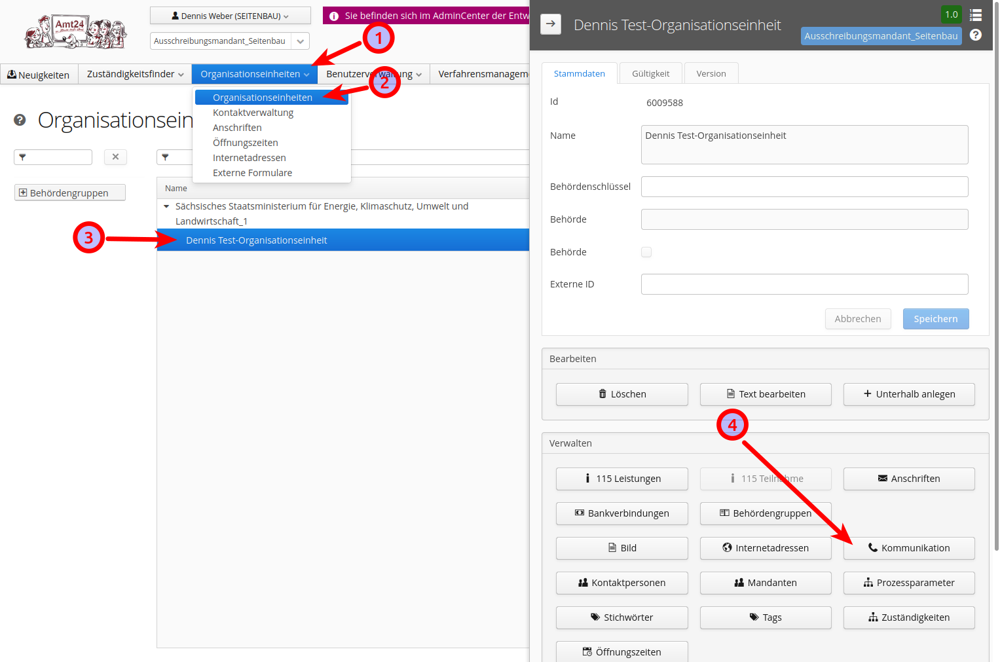

    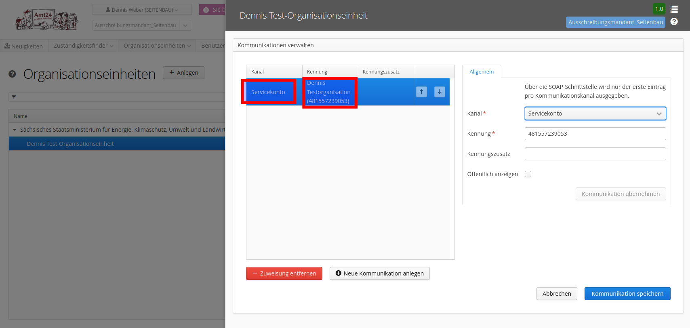

* Es existiert bereits eine Leistung, in deren Kontext der Prozess laufen soll.

  * Die Leistung hat eine "Zuständigkeit" gepflegt, welche die obige Organisationseinheit referenziert.
    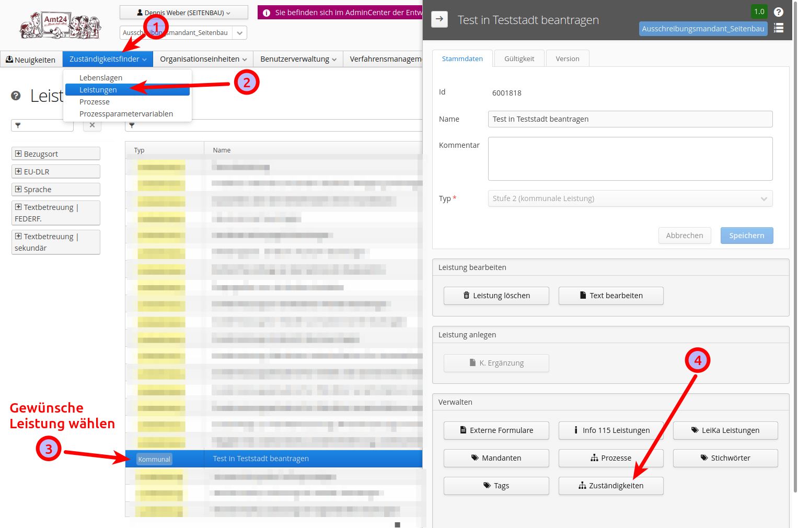

Detailierte Informationen, wie ein Blaupause-Prozess das Behörden/Organisationskonto bestimmt, finden Sie im [User Guide: Bestimmung des zuständigen Sachbearbeiters](./User Guide - Bestimmung zuständiger Sachbearbeiter.md)

### Formular einrichten

Der Blaupause-Prozess erwartet exakt ein Formular, das dem Antragsteller zum Ausfüllen angeboten wird.

Falls Sie noch kein solches Formular haben, empfehlen wir Ihnen, [diese Vorlage](./Modelliergruppe_Prozessname_ApplicantForm-v1.0-de.json) zu verwenden. Gehen Sie dazu folgendermaßen vor:

1. Laden Sie die `.json`-Datei auf Ihre Festplatte herunter. (Auf GitHub können Sie mit einem Rechtsklick auf den `Raw` Button die Option `Ziel speichern unter...` wählen.)
1. Melden Sie sich im Admincenter an und erstellen Sie dort ein neues Formular:
   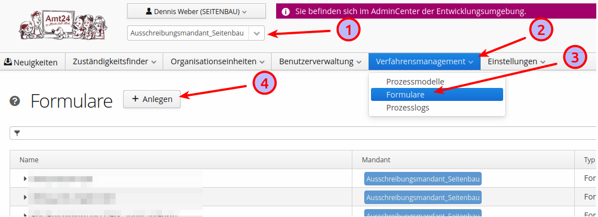
1. Vergeben Sie einen Formularnamen. Wir empfehlen, dass dieser aus 3 Komponenten besteht, getrennt durch einen Underscore `_`.
   1. Ihre Organisation
   1. Dem Namen des Prozesses
   1. Einer Bezeichnung, dass es sich hierbei um das Antragstellerformular (und nicht z. B. um ein Prüfformular, oder das eines Sachbearbeiters handelt).
   1. z. B. `LandesdirektionSachsen_Landarztgesetz_ApplicantForm`
1. Laden Sie die `.json` Datei hoch:
   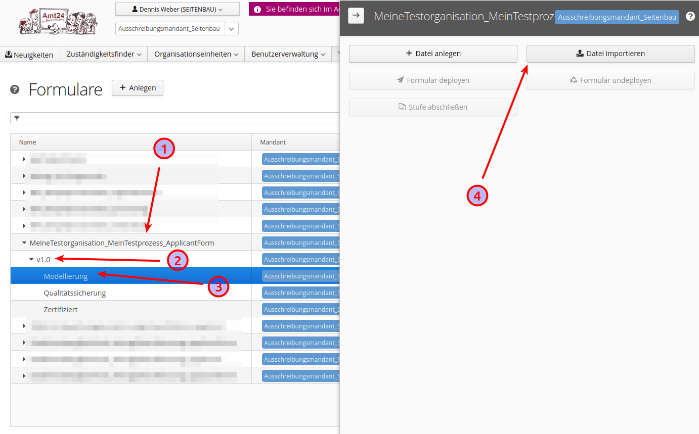
   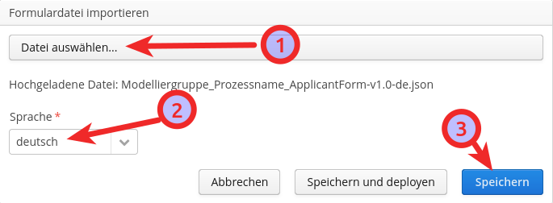
1. Sie können das Formular nun über den `Datei bearbeiten` Button bearbeiten.
   * Eine Anleitung zum Erstellen von Formularen ist nicht Bestandteil dieses Dokuments. Falls Sie dazu weitere Hilfe benötigen, siehe [weitere Hilfe](#weitere-hilfe).
   * Falls Sie später eine Datenübertragung als XML-Datei beabsichtigen: Beachten Sie bitte, dass Sie für das `ID` Attribut eines jeden Formularfelds und jeder Formulargruppe einen sprechenden Namen verwenden und nicht die automatisch generierten IDs benutzten. Die sprechenden Namen müssen den [XML-Element Namensregeln](https://stackoverflow.com/a/31130882) entsprechend. Wir empfehlen die Verwendung von camelCase.

Falls Sie bereits ein Formular erstellt haben oder nicht die Vorlage nutzen möchten, prüfen Sie bitte, ob eine eingehende und ausgehende Anbindung an die Prozessinstanzvariable `applicantForm` besteht (in dieser Variable erwartet der Prozess die Formulardaten). Sie können dies im Formulardesigner sehen, nachdem Sie das oberste Element angeklickt haben:

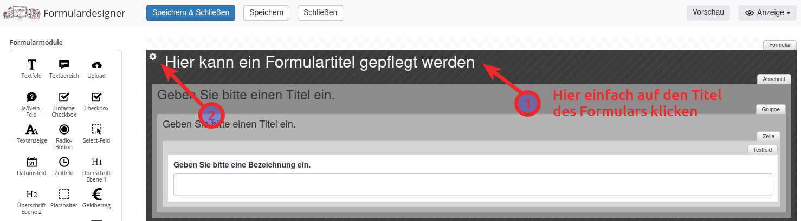

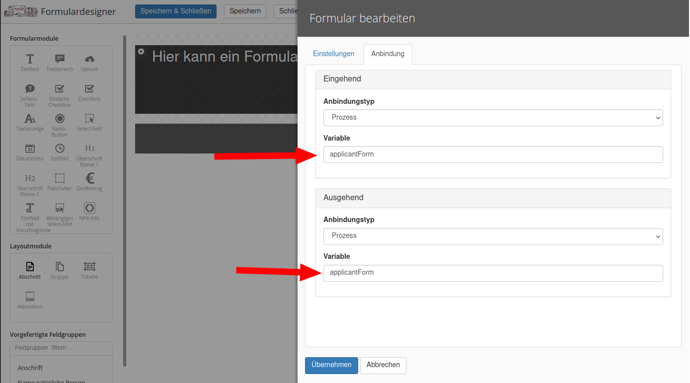

Zuletzt müssen Sie sicherstellen, dass das Formular deployt ist:

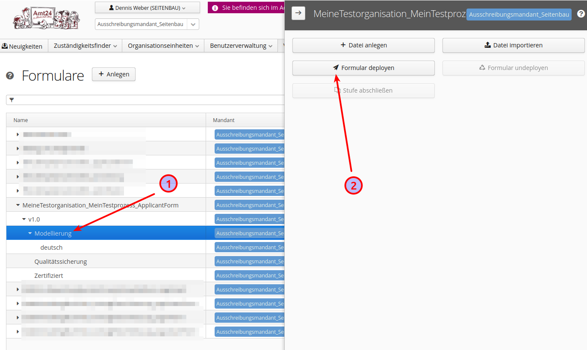


### Neuen Prozess in Amt24 einrichten

1. Laden Sie die [Modelldatei des Blaupause-Prozesses](./sk-blaupausenprozess.bpmn20.xml) auf Ihre Festplatte herunter. (Auf GitHub können Sie mit einem Rechtsklick auf den `Raw` Button die Option `Ziel speichern unter...` wählen.)
1. Legen Sie einen neuen Prozess an:
   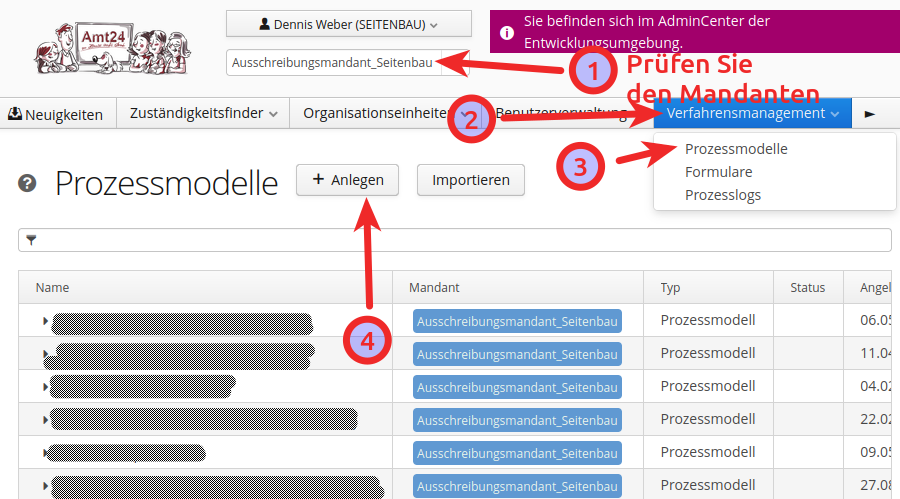
1. Wir empfehlen, dass dieser aus 2 Komponenten, getrennt durch einen Bindestrich `-` besteht:
   1. Ihre Organisation
   1. Dem Namen des Prozesses
   1. z. B. `landesdirektionSachsen-studienplatzNachLandarztgesetz`
1. Importieren Sie die im ersten Schritte heruntergeladene `.bpm20.xml`-Datei:
   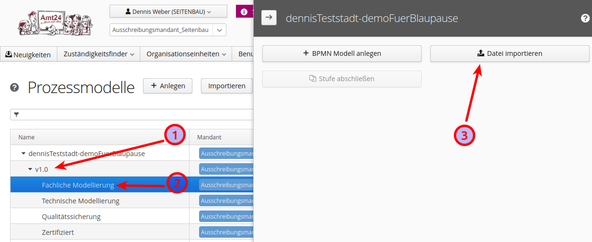
1. Ändern Sie den Dateinamen auf den gleichen Namen wie in Schritt 3:
   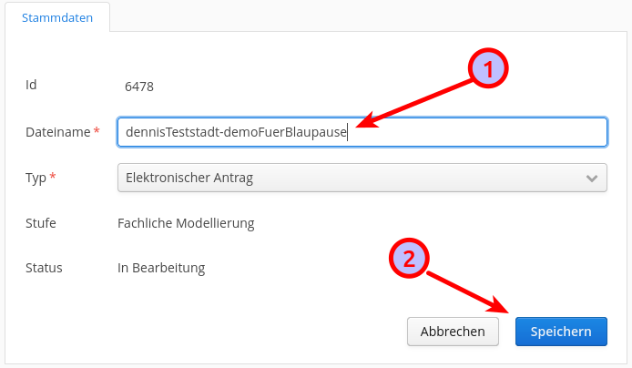
1. Verschieben Sie das Prozessmodell in die Stufe "Technische Modellierung".
   1. Geben Sie die Modelldatei frei:
      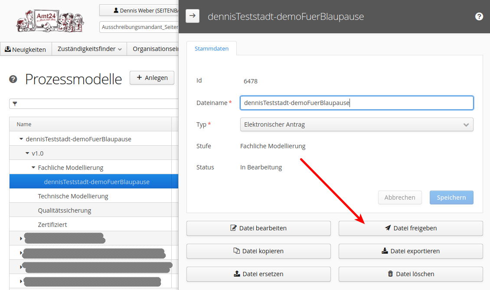
   1. Schließen Sie die Stufe "Fachliche Modellierung" ab:
      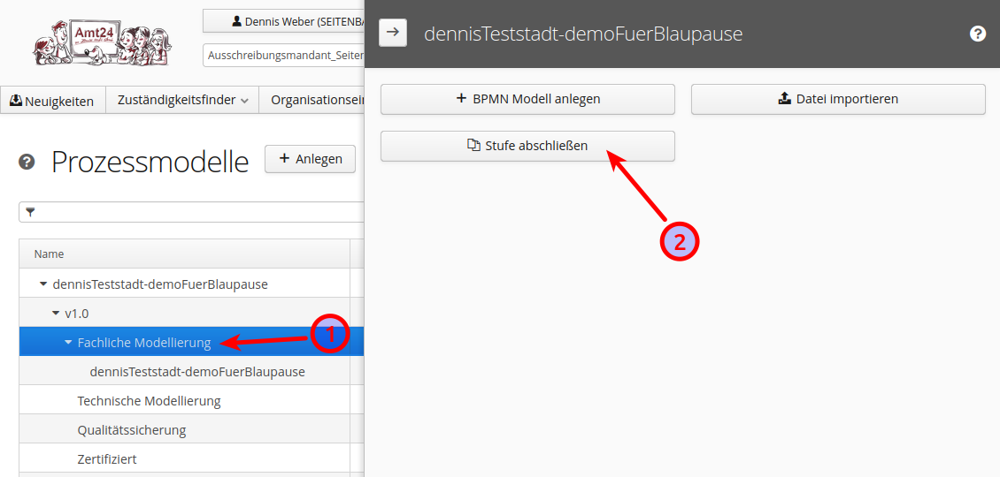


### Prozess-ID anpassen

1. Öffnen Sie das Prozessmodell im Onlineeditor:
   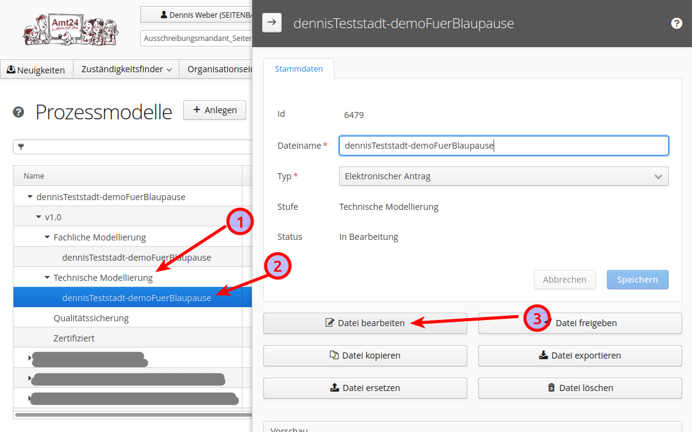
1. Ändern Sie den `Process identifier`. Der linke Teil (im Screenshot `m6000527.`) ist ihre Mandanten-ID und wurde automatisch gesetzt. Der rechte Teil (nach dem Punkt `.`) soll auf den gleichen Wert wie im Abschnitt "[Neuen Prozess in Amt24 einrichten](#neuen-prozess-in-amt24-einrichten)" gesetzt werden:
   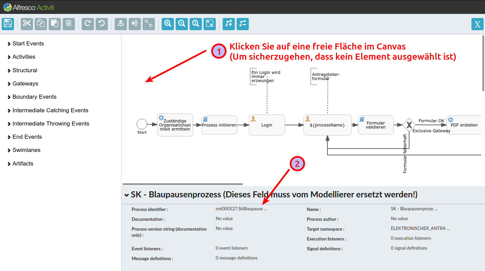

### Prozessname anpassen

1. Ändern Sie das `Name` Attribut des Prozesses auf einen Wert, der Ihren Prozess / Ihre Leistung gut beschreibt (z. B. `Hund in Teststadt anmelden`):
   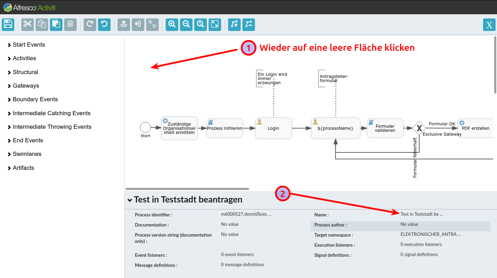

1. Öffnen Sie den "Prozess initiieren" Scripttask:
   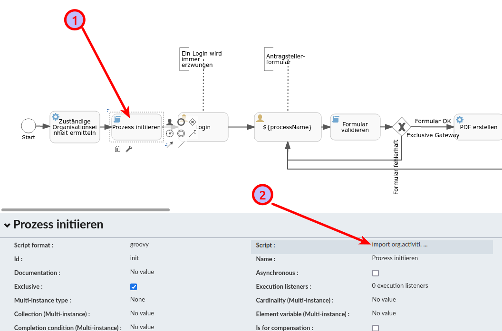

1. Suchen Sie die folgende Zeile:
   ```groovy
   String displayedProcessName = "REPLACE_ME" // TODO: Modellierer müssen diesen Namen abändern.
   ```

1. Ersetzen Sie das `REPLACE_ME` durch den Namen Ihres Prozesses (also den Wert, den Sie auch bei Schritt 1 gewählt haben). Der dahinterstehende Kommentar können Sie ebenfalls entfernen. z. B. 
   ```groovy
   String displayedProcessName = "Test ist Teststadt beantragen"
   ```

   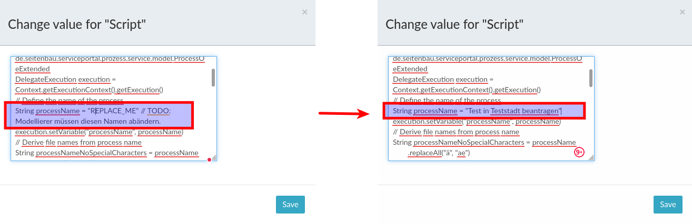

1. Speichern Sie die Änderungen am Script-Task durch Klick auf den "Save" Button.

### Referenziertes Formular anpassen

1. Öffnen Sie das `Form Key` Attribut des User-Tasks zum Antragsstellerformular:
   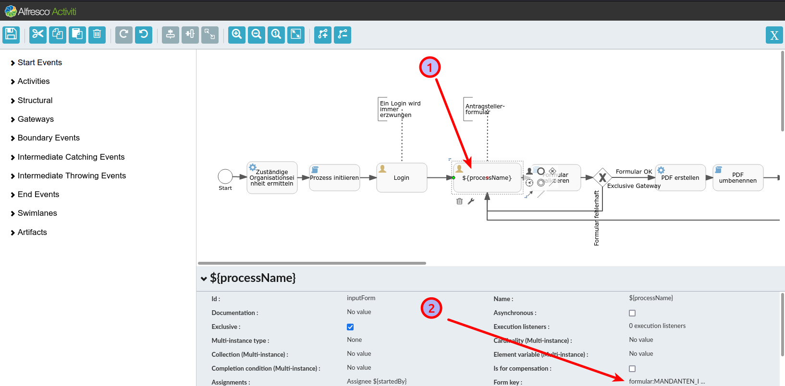
1. Der Form-Key besteht aus diesen 4 Komponenten, die durch einen Doppelpunkt `:` getrennt sind: `formular:MANDANTEN_ID:FORM_NAME:VERSION` Ändern Sie diese folgendermaßen ab:
   1. `formular`: Hier sind keine Änderungen notwendig. Lassen Sie den Wert einfach so stehen
   1. `MANDANTEN_ID`: Diese können Sie aus dem Amt24-Admincenter auslesen. Öffnen Sie dieses dazu am besten in einem neuen Tab und navigieren Sie wie im Screenshot dargestellt:
      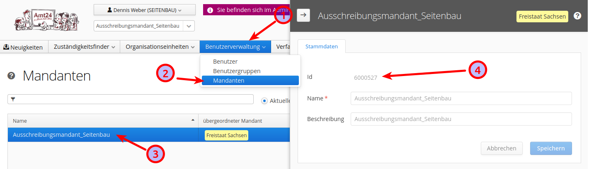
   1. `FORM_NAME`: Dies entspricht dem im Abschnitt "[Formular einrichten](#formular-einrichten)", Punkt 3 gewählten Namen.
   1. `VERSION`: Dies entspricht der im Abschnitt "[Formular einrichten](#formular-einrichten)" gewählten Version. Falls Sie den Prozess zum ersten Mal einrichten, ist dies `v1.0`
1. Der neue Form-Key könnte beispielsweise so aussehen: `formular:6000527:MeineTestorganisation_MeinTestprozess_ApplicantForm:v1.0`
1. Verlassen Sie das "Form Key" Feld, indem Sie z. B. auf eine weiße Fläche im Prozessmodell klicken.

### Datenformat auswählen

1. Entscheiden Sie sich, in welchem Format Sie die Antragsdaten erhalten möchten.
1. Entfernen Sie die **Verbindungen** (die Scripttasks (also die Tasks mit den blauen Schriftrollen Icons) selbst können Sie stehen lassen) zu Datenformaten, die Sie nicht benötigen:
   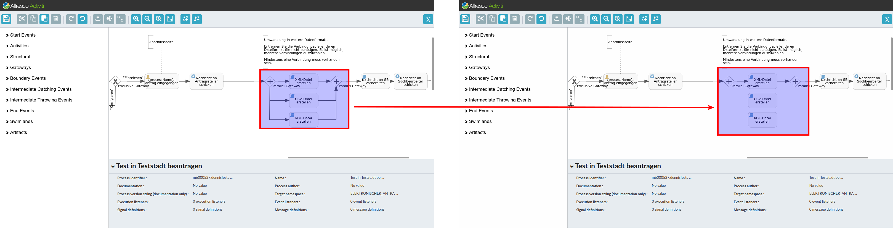

### Deployen

1. Speichern Sie das Prozessmodell ab:
   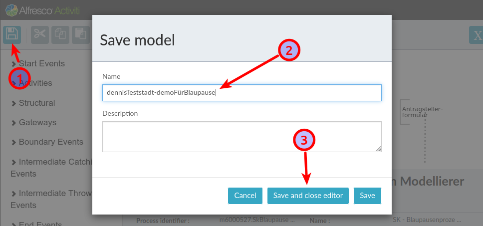
1. Deployen Sie das Prozessmodell:
   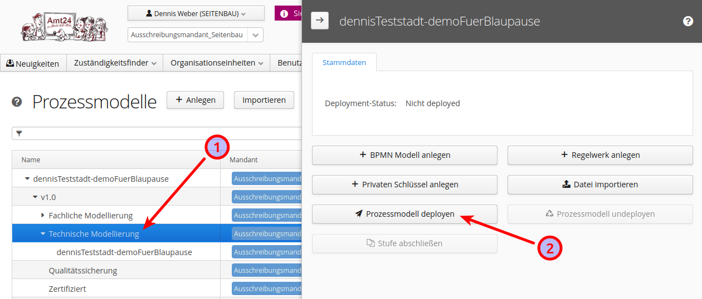
   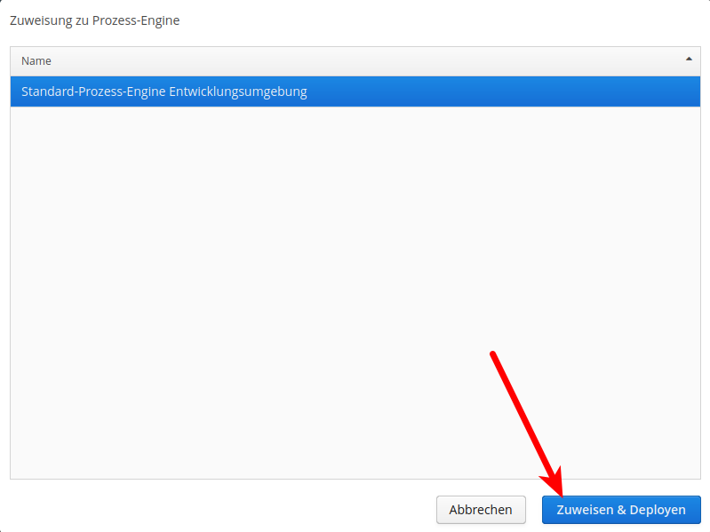

## Prozess testen

Aktivieren und verbinden Sie Ihren Prozess mit der erstellten Leistung:

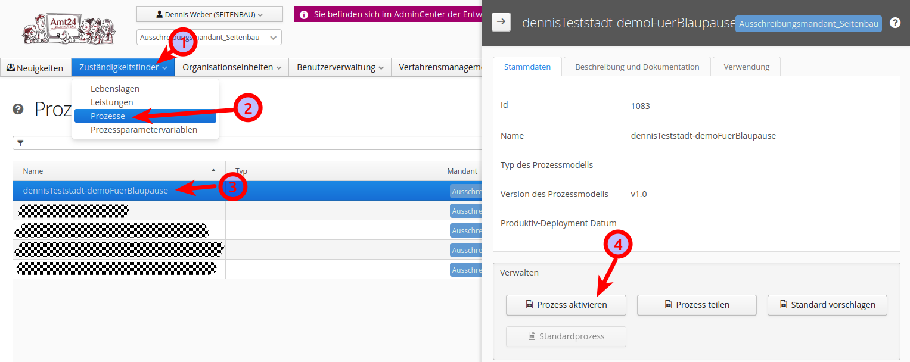

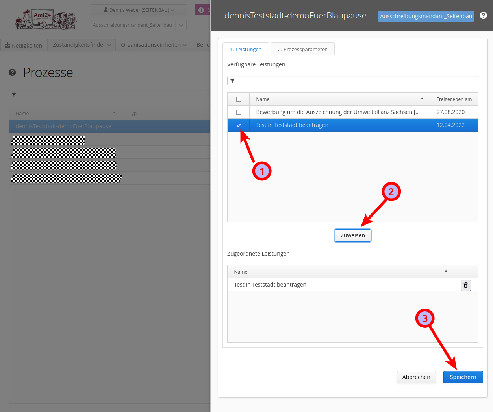

Ihr Prozess kann nun auf dem Dev-System aufgerufen werden. Öffnen Sie das [Amt24-Dev-System](https://amt24dev.sachsen.de) und suchen Sie nach Ihrem Prozess. Falls Sie in den Zuständigkeiten (siehe Abschnitt [Voraussetzungen](#voraussetzungen)) einen Ort eingeschränkt haben, geben Sie auch diesen bei der Suche an.

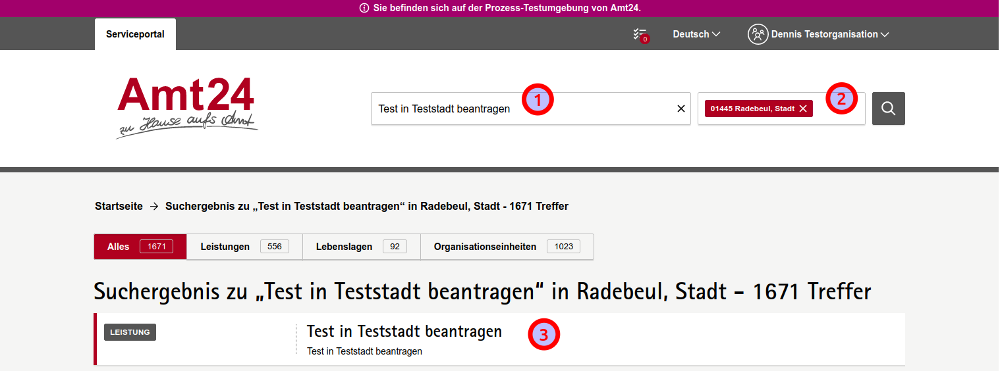

Starten Sie den Prozess über den hervorgehobenen Button:

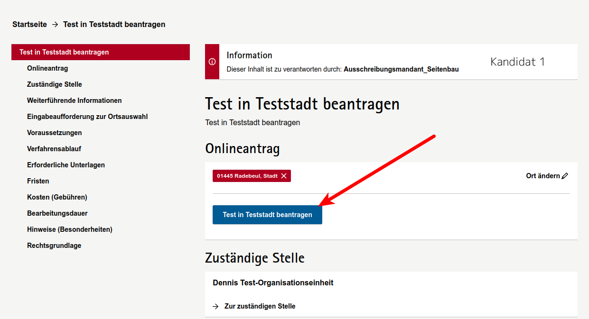

Falls Sie auf Fehlermeldungen wie `Die Liste der Aufgaben konnte nicht abgerufen werden.` stoßen, öffnen Sie wieder das Admincenter und prüfen Sie die Prozesslogs. Die dort stehenden Fehlermeldungen helfen Ihnen eventuell bei der Fehlersuche:

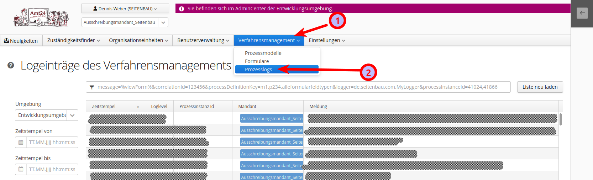

## Vorbereitung zur Übertragung auf das Live-System

### Prozessparameter

Prozesse, die auf dem Blaupause-Prozess basieren, verwenden keine Prozessparameter. Dieser Fakt muss allerdings noch am Prozess hinterlegt werden. Setzen Sie dazu die notwendige Checkbox:

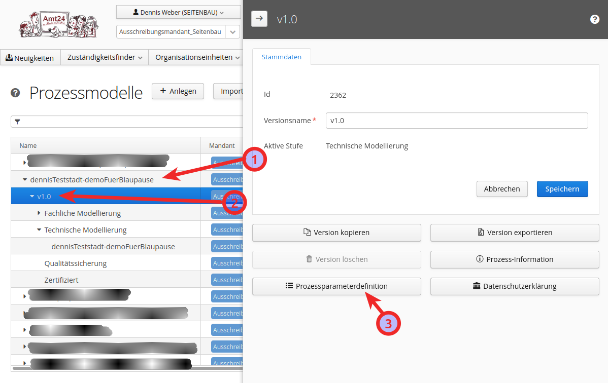

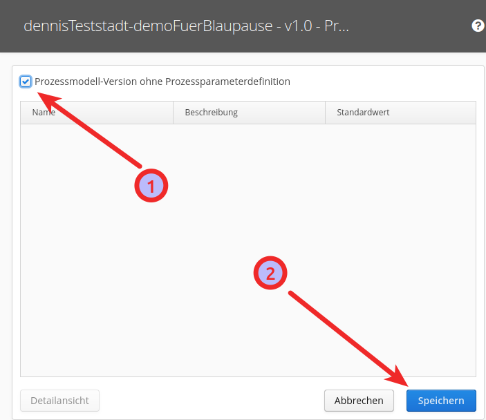

### Datenschutzerklärung

Alle Prozesse auf dem Live-System benötigen zwangsweise eine gültige Datenschutzerklärung. Öffnen Sie diese über diesen Button:

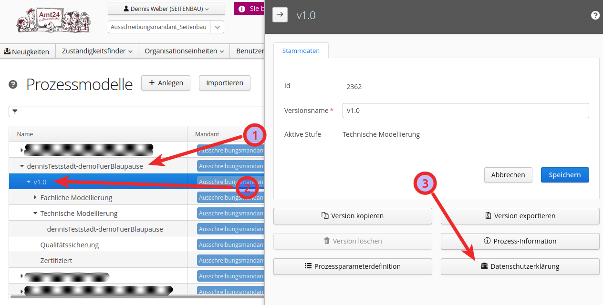

Anschließend pflegen Sie die dortigen Felder und bestätigen das mit einem Klick auf den `Speichern` Button. (Bitte beachten Sie, dass SEITENBAU keine Unterstützung zu Rechtsfragen liefern kann.)

### Zertifizierung

Wenn Sie den Prozess ausgiebig testen konnten und mit ihm zufrieden sind, ist vor Übertragung auf das Live-System eine Zertifizierung notwendig. Mehr Informationen dazu finden Sie im [Amt24 Wiki Artikel "Einreichung von Zertifizierungsanfragen"](https://wiki.amt24.sachsen.de/bin/view/Zertifizierungen/Einreichung%20von%20Zertifizierungsanfragen/).

### Übertragung auf das Live-System

Nach der Zertifizierung können Sie die Übertragung des Prozesses anstoßen. Schicken Sie dazu eine Mail mit der Bitte zur Übernahme des Prozesses auf das Produktivsystem an den SID: [servicedesk@sid.sachsen.de](mailto:servicedesk@sid.sachsen.de). Benennen Sie dabei bitte auch das Ticket, in dem die Zertifizierung erfolgt ist.

## Weitere Hilfe

SEITENBAU bietet (kostenpflichtige) Unterstützung bei individuellen Fragen zur Modellierung und zum Formulardesign. Ebenfalls werden Schulungen und die Umsetzung kompletter Anträge angeboten. Bei Interesse können Sie eine Mail an public-service@seitenbau.com schicken.
