# Amt24 - Blaupause-Prozess

<!-- TOC start (generated with https://github.com/derlin/bitdowntoc) -->

- [Funktionsumfang](#funktionsumfang)
- [Voraussetzungen zur Nutzung der Blaupause](#voraussetzungen-zur-nutzung-der-blaupause)
- [Wie erstelle ich einen Prozess mit dem Blaupauseassistenten?](#wie-erstelle-ich-einen-prozess-mit-dem-blaupauseassistenten)
    * [Formular einrichten](#formular-einrichten)
    * [Neuen Prozess mit Blaupauseassistent erstellen](#neuen-prozess-mit-blaupauseassistent-erstellen)
- [Wie kann ich meinen Prozess testen?](#wie-kann-ich-meinen-gebauten-Prozess-testen)
	* [Prozess aktivieren](#prozess-aktivieren)
	* [Prozess testen](#prozess-testen)
- [Wie mache ich den Prozess allen Antragsberechtigten verfügbar?](#wie-mache-ich-den-prozess-allen-antragsberechtigten-verfügbar)
    * [Formular zertifizieren](#formular-zertifizieren)
    * [Übertragung auf das Produktivsystem](#übertragung-auf-das-produktivsystem)
    * [Prozess auffindbar machen](#prozess-auffindbar-machen)
- [Weitere Hilfe](#weitere-hilfe)
- [Changelog](#changelog)

<!-- TOC end -->

Der Blaupause-Prozess ist eine Vorlage, die dazu dient, möglichst schnell und einfach Anträge auf Amt24 bereitstellen zu können. 
Seine Verwendung richtet sich dabei speziell an Personen, die noch keine Erfahrung in der Prozessmodellierung haben oder lediglich das Layout der Formular-Funktion von Amt24 verwenden möchten.

Ab dem `Release 1.5` (07.04.2025) unterstützt der Blaupause-Assistenten ausschließlich die Generierung von Prozessen mit den Authentifizierungsmitteln `BundID` und `Mein Unternehmenskonto`.

## Funktionsumfang

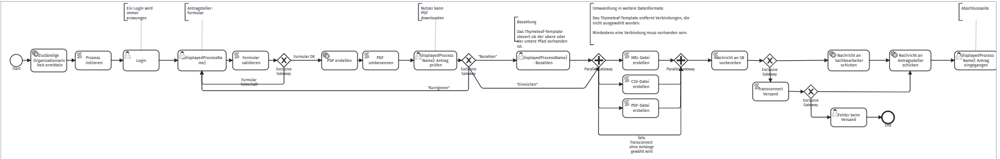

Der Blaupause-Prozess durchläuft nach seiner Konfiguration durch die Modellierenden diese Schritte:

1. Bestimmung des zuständigen Behördenkontos (anhand der konfigurierten Organisationseinheit).
1. Login des Antragsstellers je nach Konfiguration mit `BundID` oder `Mein Unternehmenskonto`.
1. Ausfüllen eines konfigurierbaren Formulars.
1. Umwandlung des Formulars in eine PDF-Datei.
1. Anzeige einer Zusammenfassungsseite, auf der die PDF-Datei geprüft werden kann.
1. (Optional) Online-Bezahlung über ePayBL
1. "Antrag eingereicht" Nachricht an das verwendete `BundID-` oder `Mein Unternehmenskonto` der Antragsstellenden.
1. Umwandlung in ein konfigurierbares Datenformat für die Sachbearbeitung. Die modellierende Person wählt dabei
   zwischen:
    1. XML
    1. CSV
    1. PDF
1. "Antrag eingegangen" Nachricht an das hinterlegte Postfach der Organisationseinheit, per Transconnect Anbindung oder per FIT-Connect Anbindung mit den gewählten Datenformaten.

## Voraussetzungen zur Nutzung der Blaupause

- Falls Sie die Bezahlfunktion nutzen möchten, müssen Sie einen entsprechenden Mandanten beim SID unter [servicedesk@sid.sachsen.de](mailto:servicedesk@sid.sachsen.de) beantragen. Dies kann mehrere Wochen dauern.
- Sie haben Zugriff auf das AdminCenter des Amt24-Entwicklungssystem https://admincenter.amt24dev.sachsen.de.
    * Sie sind dort für Ihren gewünschten Mandanten (d. h. Ihre Kommune/Landratsamt/Behörde) freigeschaltet.
    * Sie sind den Benutzergruppen `Mandantenredakteur Behördenkontenverwalter. Mandantenredakteur Behörden und Zuständigkeiten` und `Prozessassistent - Nutzer`
      zugeordnet.
Bitte beachten Sie, dass die Benutzergruppe Prozessassistent-Nutzer nur nach Besuch einer Schulung bereitgestellt wird.
- In Ihrem gewünschten Mandanten sind die Daten zum Bild, Datenschutzbeauftragten und Impressum gepflegt:
  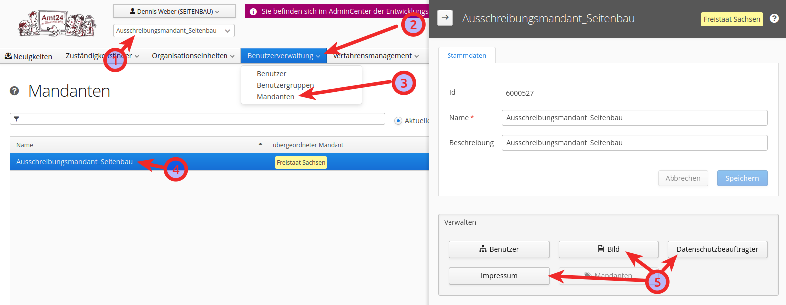

- Es existiert bereits ein Behördenkonto, eine Transconnect Anbindung oder eine FIT-Connect Anbindung, welche(s) die Antragsdaten empfangen soll.

- Es existiert bereits eine Organisationseinheit, die für die Verarbeitung der Antragsdaten zuständig ist.

    * Diese Organisationseinheit hat eine "Kommunikation" mit dem Kanal "Servicekonto" gepflegt, welches auf ein existierendes Behördenkonto zur Antragsannahme verweist: 
      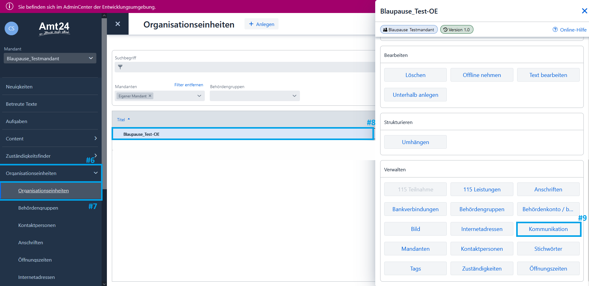

      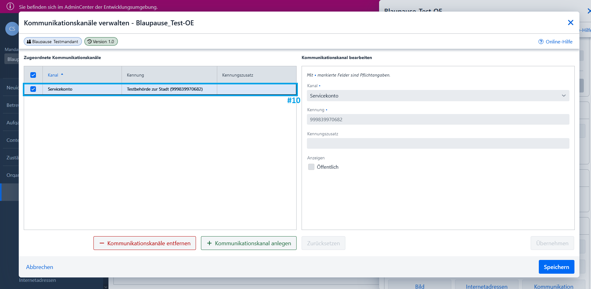
	  
	  Detaillierte Informationen, wie ein Blaupause-Prozess das Behörden/Organisationskonto bestimmt, finden Sie
im [User Guide: Bestimmung des zuständigen Sachbearbeiters](./User_Guide_Bestimmung_zustaendiger_Sachbearbeiter.md)

- Es existiert bereits eine Leistung, in deren Kontext der Prozess aufrufbar sein soll.

    * Die Leistung hat eine "Zuständigkeit" gepflegt, welche die obige Organisationseinheit referenziert.
      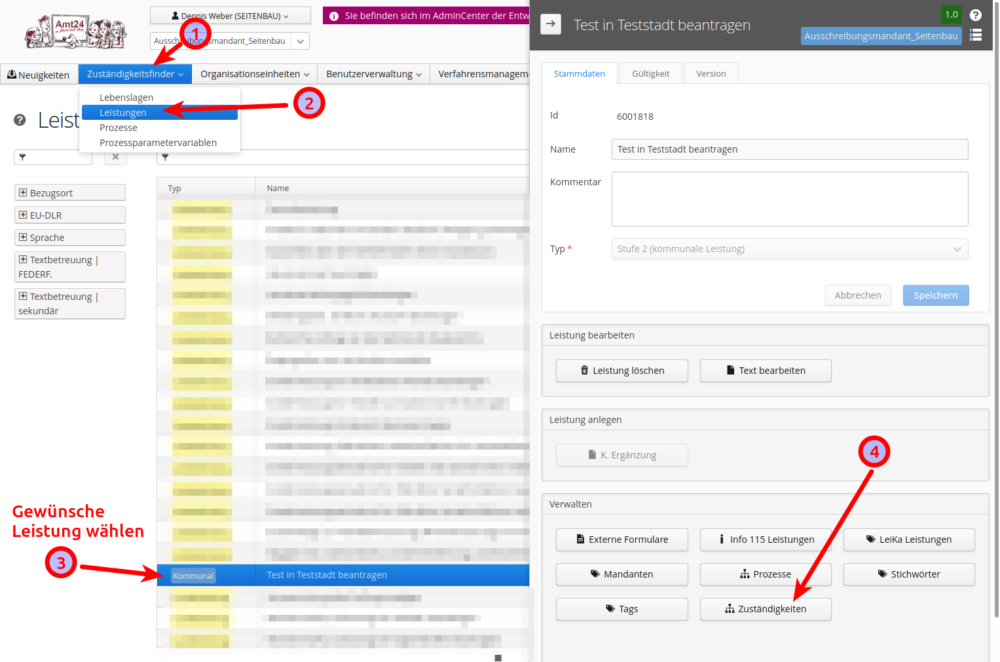

## Wie erstelle ich einen Prozess mit dem Blaupauseassistenten?

Um den Blaupause-Prozess zu nutzen und auf Ihre Anforderungen anzupassen, müssen Sie folgende Punkte durchführen.

### Formular einrichten

Der Blaupause-Prozess erwartet exakt ein Formular, das dem Antragstellenden zum Ausfüllen angeboten wird.

Falls Sie noch kein solches Formular haben, empfehlen wir
Ihnen, [diese Vorlage](./Modelliergruppe_Prozessname_ApplicantForm-v1.0-de.json) zu verwenden. Gehen Sie dazu
folgendermaßen vor:

1. Laden Sie die `.json`-Datei auf Ihre Festplatte herunter. (Auf GitHub können Sie mit einem Rechtsklick auf den `Raw`
   Button die Option `Ziel speichern unter...` wählen.)
1. Melden Sie sich im AdminCenter an und erstellen Sie dort ein neues Formular:
   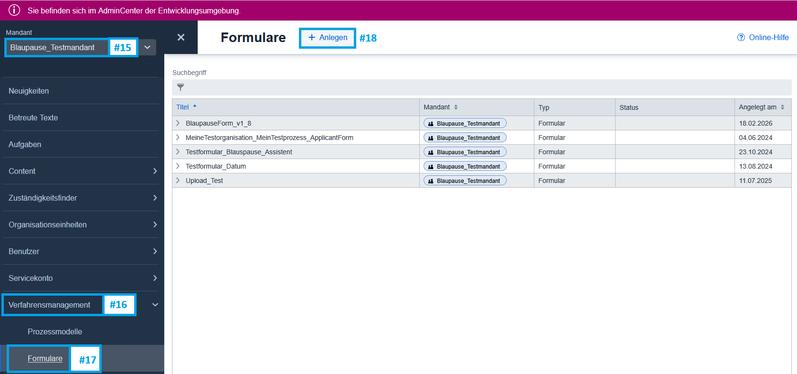
1. Vergeben Sie einen Formularnamen. Wir empfehlen, dass dieser aus 3 Komponenten besteht, getrennt durch einen
   Underscore `_`.
    1. Ihre Organisation
    1. Dem Namen des Prozesses
    1. Einer Bezeichnung, dass es sich hierbei um das Formular für Antragsstellenden (und nicht z. B. um ein Prüfformular, oder
       das Formular der Sachbearbeitung handelt). z. B. `LandesdirektionSachsen_Landarztgesetz_ApplicantForm`
1. Laden Sie die `.json` Datei hoch:
   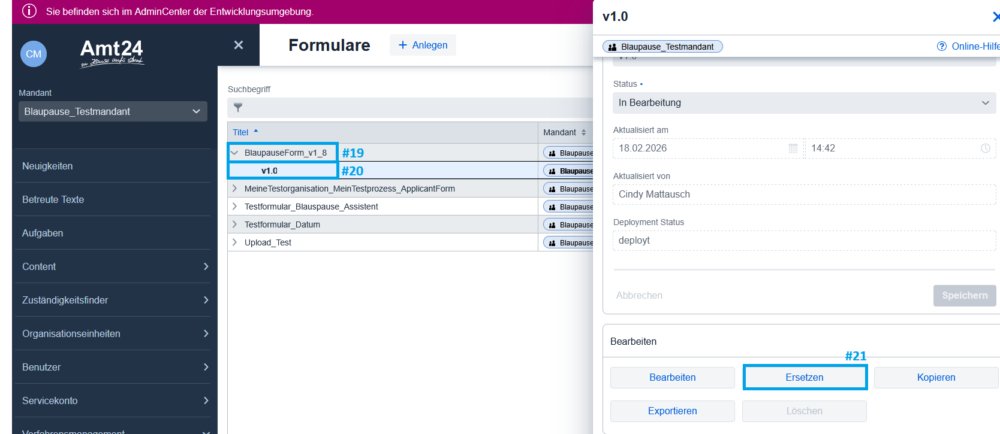
   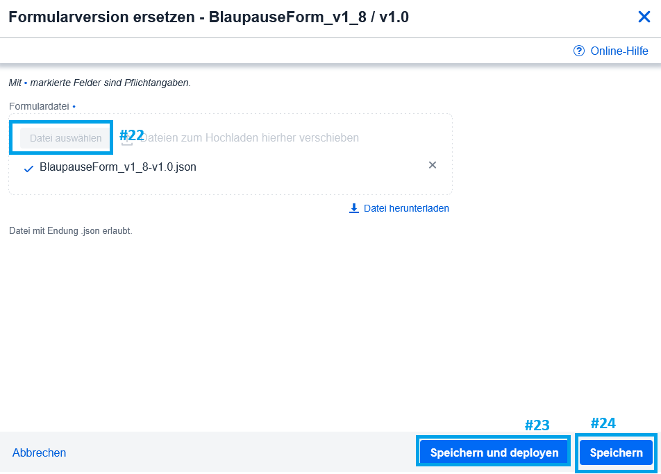
1. Sie können das Formular nun über den `Datei bearbeiten` Button bearbeiten.
    * Eine Anleitung zum Erstellen von Formularen ist nicht Bestandteil dieses Dokuments. Falls Sie dazu weitere Hilfe
      benötigen, siehe [weitere Hilfe](#weitere-hilfe).
	  
	  Falls Sie später eine Datenübertragung als XML-Datei beabsichtigen: Beachten Sie bitte, dass Sie für das `ID`
      Attribut eines jeden Formularfelds und jeder Formulargruppe einen sprechenden Namen verwenden und nicht die
      automatisch generierten IDs benutzten. Die sprechenden Namen müssen
      den [XML-Element Namensregeln](https://stackoverflow.com/a/31130882) entsprechen. 
	  Wir empfehlen den Verzicht auf Trennzeichen und das Zusammenziehen der Wörter anhand Groß-/Kleinschreibung. Bsp: statt Formular_Feld_ID → FormularFeldID

Sofern Sie bereits ein eigenes Formular (ohne die Vorlage) erstellt haben, überprüfen Sie bitte, ob eine ein- und ausgehende Anbindung an die Prozessinstanzvariable applicantForm besteht (in dieser Variable erwartet der Prozess die Formulardaten). 
Klicken Sie dazu im Formulardesigner auf das oberste Element und wählen das Zahnrad für die Einstellungen:

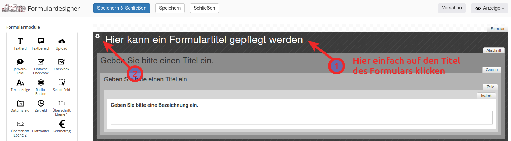

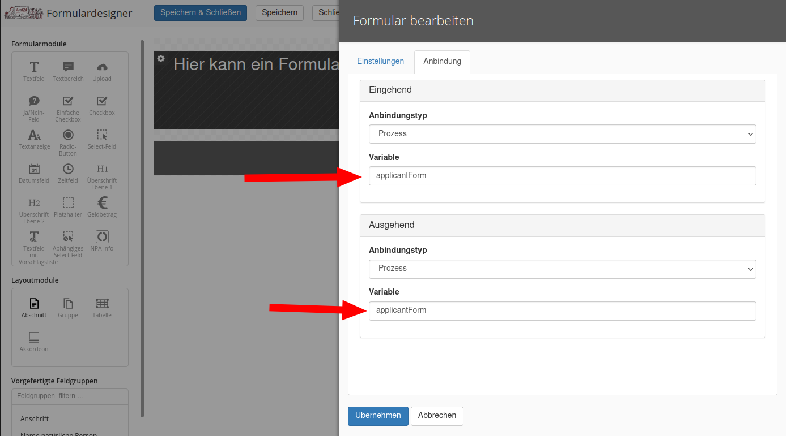

Zuletzt müssen Sie sicherstellen, dass das Formular deployt ist:

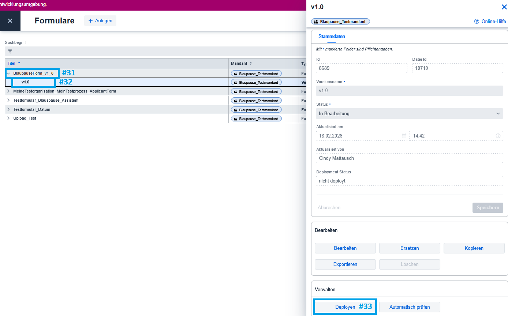

Achten Sie bitte für die Erstellung von benutzerfreundlichen Formularen auf die [Guidelines](https://serviceportal-machbar.de/guidelines/formulare/).

### Neuen Prozess mit Blaupauseassistent erstellen

Starten Sie nun der Blaupauseassistenten über den entsprechenden Button:

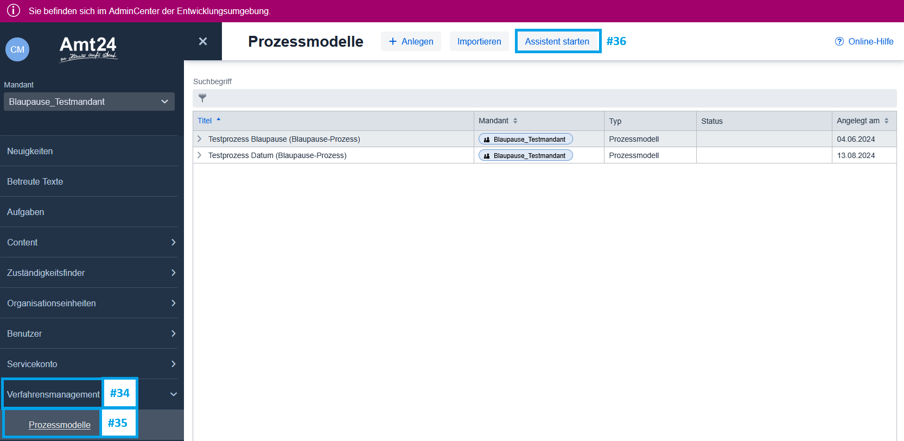

Sie werden jetzt erneut zum Login aufgefordert. Wählen Sie als Option das Amt24 Servicekonto aus. Geben Sie dabei die gleichen Zugangsdaten ein, mit denen Sie sich auch im AdminCenter angemeldet haben.
Anschließend führt Sie der Assistent durch die notwendigen Schritte. Bitte beachten Sie, dass Sie den Assistenten innerhalb von 8 Stunden durchlaufen haben müssen (falls Sie dieses Limit überschreiten, können Sie den Assistenten aber einfach erneut starten).

## Wie kann ich meinen gebauten Prozess testen?

### Prozess aktivieren
Aktivieren und verbinden Sie Ihren Prozess mit der erstellten Leistung:

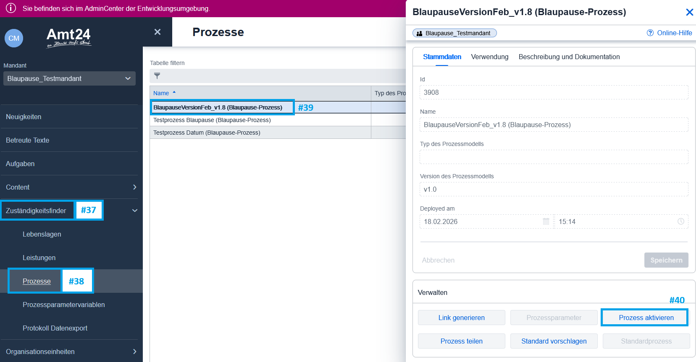

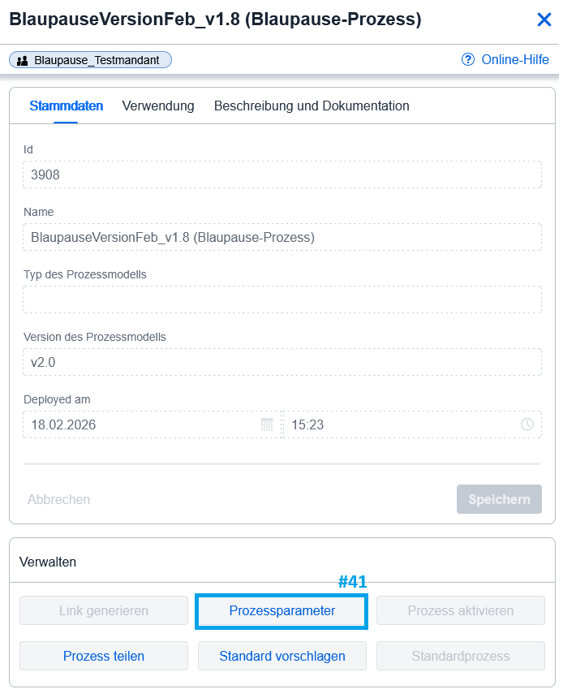

Falls Sie für Ihren Prozess die Bezahlfunktion, eine Transconnect Anbindung oder eine FIT-Connect Anbindung aktiviert haben, werden Sie die Aktivierung noch nicht abschließen
können. Öffnen Sie dann den Tab "2. Prozessparameter" (1) und befüllen Sie die Pflichtfelder über einen Klick auf das
Bearbeiten-Symbol (2). Die meisten der Parameter für die Bezahlung sind ePayBL-Parameter - dies sind Parameter, die verwendet werden, um
Ihr Bezahlungssystem zu identifizieren. Sie erhalten diese durch den SID unter [zv@sid.sachsen.de](mailto:zv@sid.sachsen.de). Falls Sie Probleme
oder Fragen haben, die sich auf die Bezahlfunktion beschränken, ist auch hier der SID der richtige Ansprechpartner. Die Parameter für die
Transconnect Anbindung oder FIT-Connect Anbindung werden benötigt, um eine verschlüsselte Verbindung zu Ihrem System aufzubauen und die Antragsdaten zu senden.

Bitte aktivieren Sie für den Prozessparameter `ePayBL-keystorePassword` die Funktion `Wert schützen` (1). Damit wird der
Wert später nicht mehr angezeigt (2) und kann dadurch nicht von anderen Personen kopiert werden:

Beachten Sie bitte, dass auf dem Amt24-Entwicklungssystem und dem Amt24-Produktivsystem unterschiedliche Daten zu verwenden sind.

### Prozess testen

Ihr Prozess kann nun auf der Entwicklungsumgebung aufgerufen werden. Öffnen Sie
das [Amt24-Entwicklungssystem](https://amt24dev.sachsen.de) und suchen Sie nach Ihrem Prozess. Falls Sie in den
Zuständigkeiten (siehe Abschnitt [Voraussetzungen](#voraussetzungen)) einen Ort eingeschränkt haben, geben Sie auch
diesen bei der Suche an.

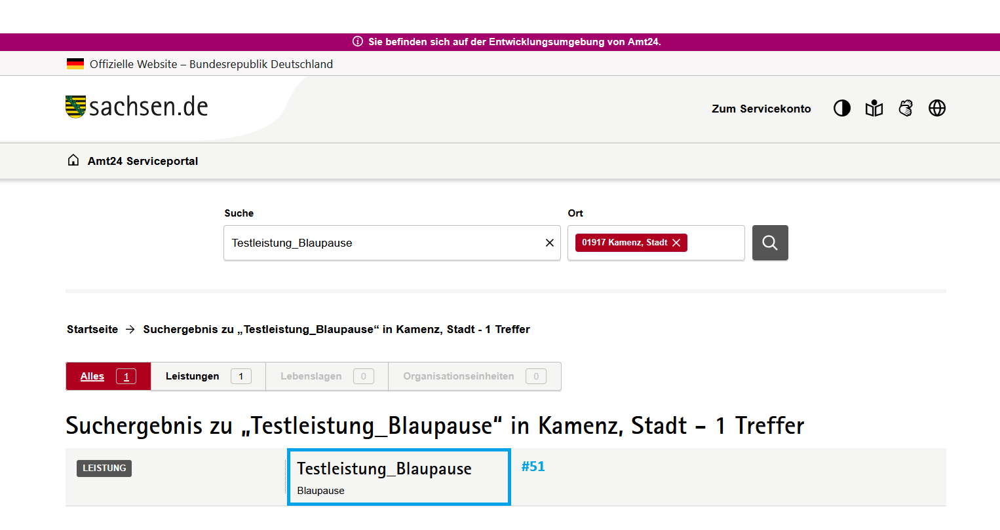

Starten Sie den Prozess über den blauen Button. Beachten Sie, dass es einige Zeit (i.d.R. 0 - 15 Minuten) dauern kann,
bis der Button angezeigt wird.

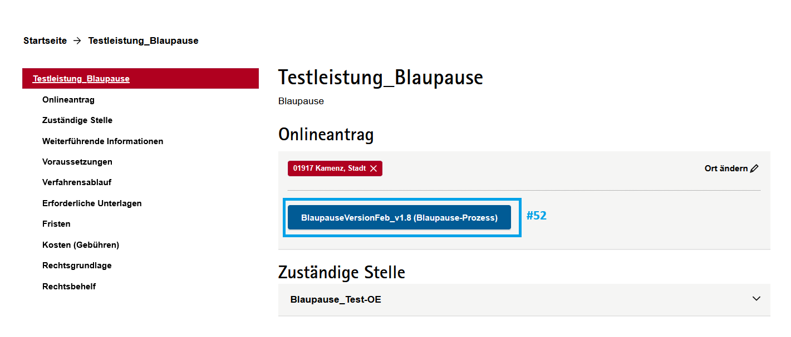

Falls Sie auf Fehlermeldungen, wie bspw. `die Liste der Aufgaben konnte nicht abgerufen werden.` stoßen, öffnen Sie wieder das AdminCenter und prüfen Sie die Prozesslogs. Die dort stehenden Fehlermeldungen helfen Ihnen eventuell bei der Fehlersuche:

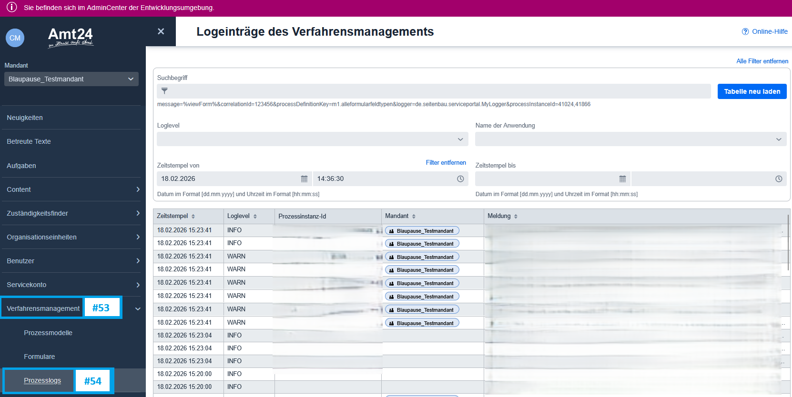

Testen Sie Ihren Prozess nun gut und ausführlich. Das bedeutet, dass Sie einmal die komplette Antragsstrecke vom Start des Antrags bis zum Eingang bei der zuständigen Behörde testen müssen. Eventuell möchten Sie auch andere Personen um weiteres Feedback bitten.

## Wie mache ich den Prozess allen Antragsberechtigten verfügbar?

### Formular zertifizieren

Wenn Sie an Ihrem Formular keine Änderungen mehr durchführen möchten, können Sie es automatisch zertifizieren. Drücken Sie dafür bei Ihrem Formular auf den Button "Formular zertifizieren". Dieser Schritt ist notwendig, da alle Formulare, die auf das Amt24 Produktivsystem übertragen werden, zuvor zertifiziert werden müssen.
Falls Ihr Formular die Zertifizierungskriterien nicht erfüllt, erhalten Sie eine entsprechende Fehlermeldung, welche die notwendigen Anpassungen beschreibt. Andernfalls wird das Formular automatisch in den Status Prüfung erfolgreich versetzt.

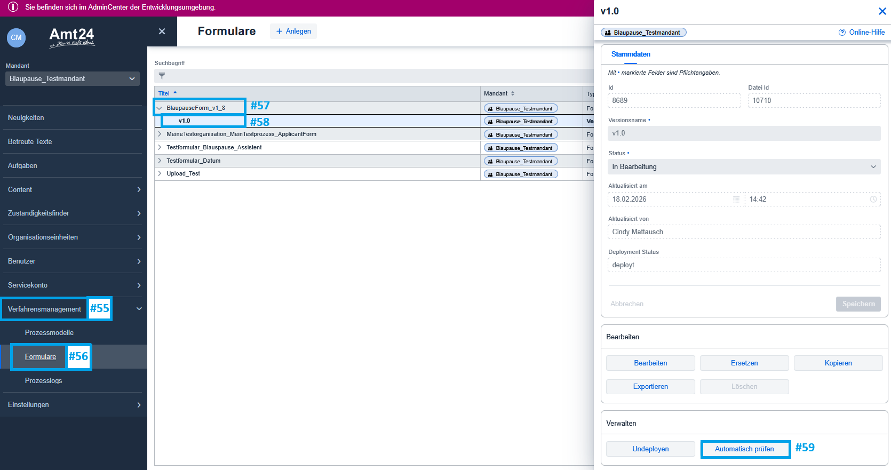

Bitte beachten Sie, sofern Sie Änderungen am Prozessmodell vorhaben, ist vor Übertragung auf das Produktivsystem eine Zertifizierung notwendig. 
Mehr Informationen dazu finden Sie im Artikel [Einreichung von Anfragen zur technischen Revision](https://doku.pmp.seitenbau.com/pages/viewpage.action?spaceKey=DFO&title=Einreichung+von+Anfragen+zur+technischen+Revision) auf der Dokumentation für Online-Dienste-Hersteller.

### Übertragung auf das Produktivsystem

Nachdem Sie Ihr Formular zertifiziert haben, schicken Sie eine E-Mail mit der Bitte zur Übernahme des Prozesses auf das Produktivsystem an den SID: [servicedesk@sid.sachsen.de](mailto:servicedesk@sid.sachsen.de). 
Nennen Sie dabei bitte Ihren Mandanten, den Namen und die Version des Prozesses, sowie den Namen und die Version Ihres Formulars.

### Prozess auffindbar machen

Nachdem Ihr Prozess durch den SID auf das Produktivsystem übertragen wurde, können Sie ihn aktivieren und damit allen Nutzenden verfügbar machen. 
Gehen Sie dazu genau wie im Abschnitt [Wie kann ich meinen Prozess testen?](#wie-kann-ich-meinen-gebauten-Prozess-testen) vor (nur dieses Mal auf dem Amt24-Produktivsystem).

Herzlichen Glückwunsch, Sie haben nun alle Schritte durchgeführt und einen wichtigen Teil zur Digitalisierung der öffentlichen Verwaltung beigetragen! 🥳

## Weitere Hilfe

Wenn Sie Fragen rund um die Nutzung des Blaupauseassistenten haben, wenden Sie sich bitte an die Amt24-Anwendungsbetreuung unter [servicedesk@sid.sachsen.de](mailto:servicedesk@sid.sachsen.de).

## Changelog

Alle Änderungen und die Versionen des Blaupause-Assistenten finden Sie im [Changelog](Changelog.md)
