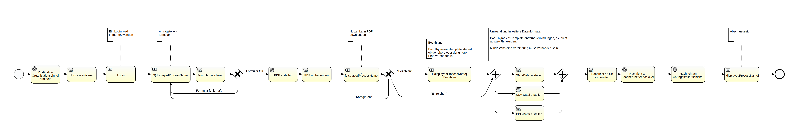
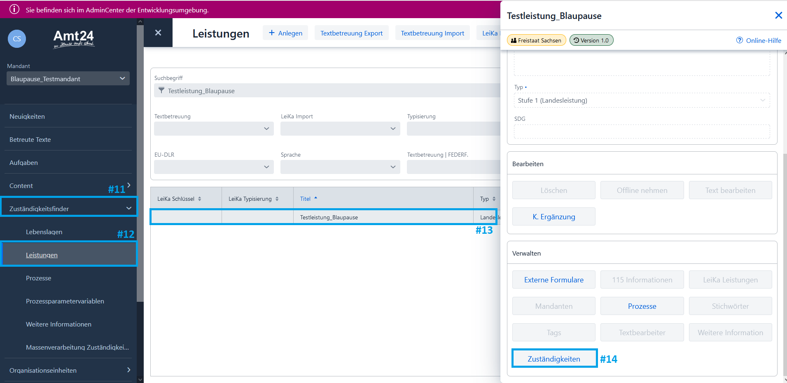
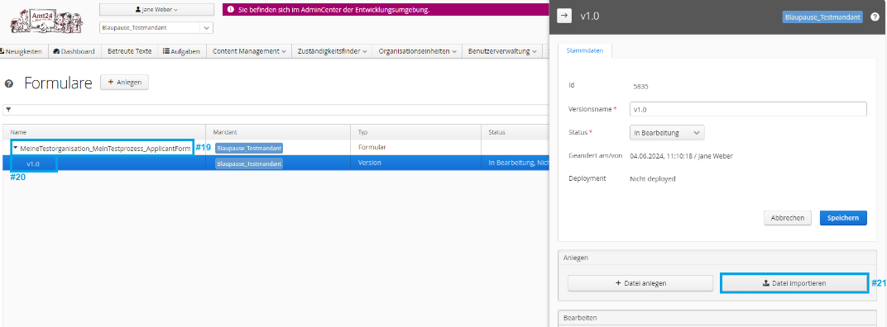
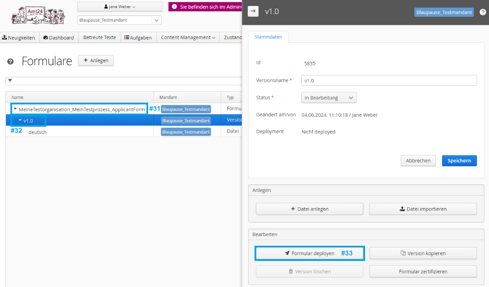
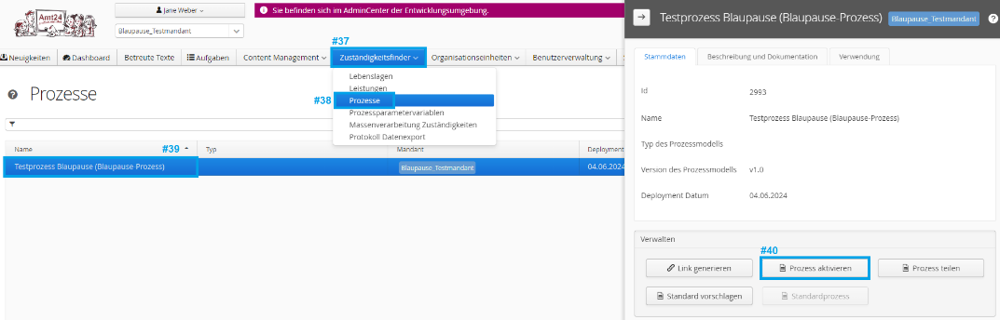
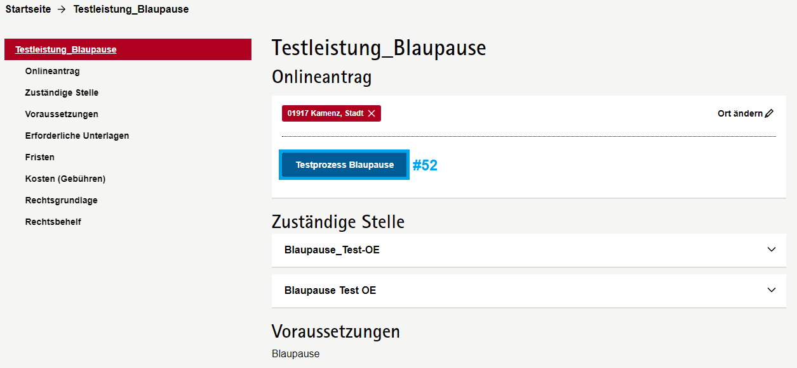

# Amt24 - Blaupause-Prozess

<!-- TOC start - https://derlin.github.io/bitdowntoc/ -->

- [Funktionsumfang](#funktionsumfang)
- [Einrichten & Anpassen des Prozesses](#einrichten--anpassen-des-prozesses)
  - [Voraussetzungen](#voraussetzungen)
  - [Formular einrichten](#formular-einrichten)
  - [Neuen Prozess in Amt24 einrichten](#neuen-prozess-in-amt24-einrichten)
  - [Prozess-ID anpassen](#prozess-id-anpassen)
  - [Prozessname anpassen](#prozessname-anpassen)
  - [Referenziertes Formular anpassen](#referenziertes-formular-anpassen)
  - [Datenformat auswählen](#datenformat-auswählen)
  - [Deployen](#deployen)
- [Prozess testen](#prozess-testen)
- [Vorbereitung zur Übertragung auf das Live-System](#vorbereitung-zur-übertragung-auf-das-live-system)
  - [Prozessparameter](#prozessparameter)
  - [Datenschutzerklärung](#datenschutzerklärung)
  - [Zertifizierung](#zertifizierung)
  - [Übertragung auf das Live-System](#übertragung-auf-das-live-system)
- [Weitere Hilfe](#weitere-hilfe)

<!-- TOC end -->

Der Blaupause-Prozess ist eine Vorlage, mit der Kommunen, Landratsämter, Ministerien und andere öffentliche Einrichtungen möglichst schnell und einfach ihre Anträge auf Amt24 bereitstellen können. Seine Verwendung richtet sich dabei auch speziell an Personen, die noch keine Erfahrung in der Prozessmodellierung haben oder nur die Formular-Funktion von Amt24 verwenden möchten.

## Funktionsumfang

Der Blaupause-Prozess durchläuft nach seiner Konfiguration durch die Modellierer diese Schritte:

1. Bestimmung des zuständigen Sachbearbeiters / Behördenkontos (anhand der konfigurierten Organisationseinheit).
1. Login des Antragsstellers mit einem Amt24-Servicekonto.
1. Ausfüllen eines konfigurierbaren Formulars, inkl. Validierung.
1. Umwandlung des Formulars in eine PDF-Datei.
1. Anzeige einer Zusammenfassungsseite, auf der die PDF-Datei geprüft werden kann.
1. "Antrag eingereicht" Nachricht an Servicekonto des Antragsstellers.
1. Umwandlung in ein konfigurierbares Datenformat für die Sachbearbeitung. Die modellierende Person wählt dabei zwischen:
   1. XML
   1. CSV
   1. PDF
1. "Antrag eingegangen" Nachricht an Servicekonto des zuständigen Sachbearbeiters mit den gewählten Datenformat.

## Erstellen eines Blaupause-Prozesses

Um den Blaupause-Prozess zu nutzen und auf Ihre Anforderungen anzupassen, müssen Sie folgende Punkte durchführen.

### Voraussetzungen

* Sie haben Zugriff auf das Admincenter des Amt24-Entwicklungssystem https://admincenter.amt24dev.sachsen.de.
  * Sie sind dort für Ihren gewünschten Mandanten (i.e. Ihre Kommune/Landratsamt/Behörde) freigeschaltet.
  * Sie sind den Benutzergruppen `Mandantenredakteur Behörden und Zuständigkeiten` und `Prozessassistent - Nutzer` zugeordnet

* In Ihrem gewünschten Mandanten sind die Daten zum Bild, Datenschutzbeauftragten und zum Impressum gepflegt:
  

* Es existiert bereits ein Behörden- oder Organisationskonto, welches die Antragsdaten empfangen soll.

* Es existiert bereits eine Organisationseinheit, die für die Verarbeitung der Antragsdaten zuständig ist.

  * Diese Organisationseinheit hat eine "Kommunikation" mit dem Kanal "Servicekonto" gepflegt, welches auf das obige Behörden-/Organisationskonto verweist:
    

    

* Es existiert bereits eine Leistung, in deren Kontext der Prozess laufen soll.

  * Die Leistung hat eine "Zuständigkeit" gepflegt, welche die obige Organisationseinheit referenziert.
    

Detaillierte Informationen, wie ein Blaupause-Prozess das Behörden/Organisationskonto bestimmt, finden Sie im [User Guide: Bestimmung des zuständigen Sachbearbeiters](./User_Guide_Bestimmung_zustaendiger_Sachbearbeiter.md)

### Formular einrichten

Der Blaupause-Prozess erwartet exakt ein Formular, das dem Antragsteller zum Ausfüllen angeboten wird.

Falls Sie noch kein solches Formular haben, empfehlen wir Ihnen, [diese Vorlage](./Modelliergruppe_Prozessname_ApplicantForm-v1.0-de.json) zu verwenden. Gehen Sie dazu folgendermaßen vor:

1. Laden Sie die `.json`-Datei auf Ihre Festplatte herunter. (Auf GitHub können Sie mit einem Rechtsklick auf den `Raw` Button die Option `Ziel speichern unter...` wählen.)
1. Melden Sie sich im Admincenter an und erstellen Sie dort ein neues Formular:
   
1. Vergeben Sie einen Formularnamen. Wir empfehlen, dass dieser aus 3 Komponenten besteht, getrennt durch einen Underscore `_`.
   1. Ihre Organisation
   1. Dem Namen des Prozesses
   1. Einer Bezeichnung, dass es sich hierbei um das Antragstellerformular (und nicht z. B. um ein Prüfformular, oder das eines Sachbearbeiters handelt).
   1. z. B. `LandesdirektionSachsen_Landarztgesetz_ApplicantForm`
1. Laden Sie die `.json` Datei hoch:
   
   
1. Sie können das Formular nun über den `Datei bearbeiten` Button bearbeiten.
   * Eine Anleitung zum Erstellen von Formularen ist nicht Bestandteil dieses Dokuments. Falls Sie dazu weitere Hilfe benötigen, siehe [weitere Hilfe](#weitere-hilfe).
   * Falls Sie später eine Datenübertragung als XML-Datei beabsichtigen: Beachten Sie bitte, dass Sie für das `ID` Attribut eines jeden Formularfelds und jeder Formulargruppe einen sprechenden Namen verwenden und nicht die automatisch generierten IDs benutzten. Die sprechenden Namen müssen den [XML-Element Namensregeln](https://stackoverflow.com/a/31130882) entsprechend. Wir empfehlen die Verwendung von camelCase.

Falls Sie bereits ein Formular erstellt haben oder nicht die Vorlage nutzen möchten, prüfen Sie bitte, ob eine eingehende und ausgehende Anbindung an die Prozessinstanzvariable `applicantForm` besteht (in dieser Variable erwartet der Prozess die Formulardaten). Sie können dies im Formulardesigner sehen, nachdem Sie das oberste Element angeklickt haben:

Zuletzt müssen Sie sicherstellen, dass das Formular deployt ist:

### Neuen Prozess mit Blaupauseassistent erstellen

TODO!

## Prozess testen

Aktivieren und verbinden Sie Ihren Prozess mit der erstellten Leistung:

Ihr Prozess kann nun auf dem Dev-System aufgerufen werden. Öffnen Sie das [Amt24-Dev-System](https://amt24dev.sachsen.de) und suchen Sie nach Ihrem Prozess. Falls Sie in den Zuständigkeiten (siehe Abschnitt [Voraussetzungen](#voraussetzungen)) einen Ort eingeschränkt haben, geben Sie auch diesen bei der Suche an.

Starten Sie den Prozess über den hervorgehobenen Button:

Falls Sie auf Fehlermeldungen wie `Die Liste der Aufgaben konnte nicht abgerufen werden.` stoßen, öffnen Sie wieder das Admincenter und prüfen Sie die Prozesslogs. Die dort stehenden Fehlermeldungen helfen Ihnen eventuell bei der Fehlersuche:

Testen Sie Ihren Prozess nun gut und ausführlich. Eventuell möchten Sie auch Ihre Kollegen oder sogar ein paar Bürger um Feedback bitten.

## Prozess allen Nutzern verfügbar machen

### Formular zertifizieren

TODO! 

### Übertragung auf das Live-System

Sind Sie soweit, dass Ihr Prozess produktiv eingesetzt werden kann? Dann schicken Sie dazu eine Mail mit der Bitte zur Übernahme des Prozesses auf das Produktivsystem an den SID: [servicedesk@sid.sachsen.de](mailto:servicedesk@sid.sachsen.de). Nennen Sie dabei bitte Ihren Mandanten, den Namen des Prozesses, sowie den Namen Ihres Formulars.

### Prozess auffindbar machen

Nachdem Ihr Prozess durch die SID auf das Live-System übertragen wurde können Sie ihn aktivieren und damit allen Nutzern verfügbar machen. Gehen Sie dazu genau wie im [Prozess testen](#prozess-testen) Abschnitt vor (nur diesmal auf dem Amt24-Livesystem). 

Herzlichen Glückwunsch, Sie haben nun alle Schritte durchgeführt und einen wichtigen Teil zur Digitalisierung der öffentlichen Verwaltung beigetragen! 🥳

## Weitere Hilfe

SEITENBAU bietet (kostenpflichtige) Unterstützung bei individuellen Fragen zur Modellierung und zum Formulardesign. Ebenfalls werden Schulungen und die Umsetzung kompletter Anträge angeboten. Bei Interesse können Sie eine Mail an public-service@seitenbau.com schicken.
