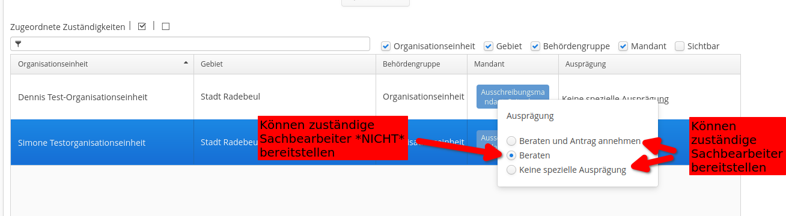

# Bestimmung des zuständigen Sachbearbeiters

## Definition

Blaupause-Prozesse verwenden einen *zuständigen Sachbearbeiter* (technisch: `assignedCaseWorker`) an mehreren Stellen, z. B. um dort hin die vom Bürger ausgefüllten Formulardaten zu verschicken. Dieser zuständige Sachbearbeiter ist dabei eine Servicekonto-ID, z. B. die eines Behörden- oder Organisationskontos. Es kann also durchaus vorkommen, dass sich mehrere reale Personen ein Konto teilen und daher mehrere reale Personen die zuständigen Sachbearbeiter sind.

## Ermittlung

Blaupause-Prozesse ermitteln die Rolle des zuständigen Sachbearbeiters wie folgt:

1. Ermitteln der zuständige Organisationseinheit anhand der Leistung und Region.
   - Diese Daten können im Admincenter unter `Zuständigkeitsfinder` --> `Leistungen` --> (Leistung auswählen) --> `Zuständigkeiten` gepflegt werden. Wählen Sie hierzu eine Organisationseinheit links und ein Gebiet rechts aus. Anschließend klicken Sie auf `Zuordnen` und auf `Speichern`.
2. Entfernen von Organisationseinheit, welche die Ausprägung `Beraten` haben. 
   - Da manche Leistungen über sogenannte *geteilte Zuständigkeiten* verfügen (bei der also mehrere Organisationseinheiten beteiligt sind), können Organisationseinheiten einer Leistung zugeordnet, aber nicht für die Rolle als *zuständiger Sachbearbeiter* relevant markiert werden.
   - Dies pflegen Sie im Admincenter an der gleichen Stelle. Wählen Sie in der letzten Spalte `Keine spezielle Ausprägung` oder `Beraten und Antrag annehmen` aus, wenn Sie möchten, dass diese Organisationseinheit einen zuständigen Sachbearbeiter stellen soll, oder nur `Beraten` wenn kein Sachbearbeiter gestellt werden soll: 
3. Durchsuchen der verbleibenden Organisationseinheiten nach deren Kommunikation.
   - Sie können im Admincenter über `Organisationseinheiten` --> `Organisationseinheiten` --> (Organisationseinheit auswählen) --> `Kommunikation` diverse Kommunikationskanäle, wie Telefonnummern, E-Mail-Adresse und Servicekonten hinterlegen.
   - Blaupause-Prozesse finden nun alle Servicekonto-Kommunikationen und lesen deren Servicekonto-IDs ein.
4. Kontrolle der Ergebnisse
   - Blaupause-Prozesse prüfen nun ob exakt eine Servicekonto-ID übrigt bleibt und definiert diese als *zuständigen Sachbearbeiter*.
   - Falls es keine gefundenen Servicekonto-IDs gibt, wird eine entsprechende Fehlermeldung in die Prozesslogs geschrieben und der Prozess abgebrochen.
   - Falls es mehr als ein Servicekonto gibt, wird ebenfalls eine entsprechende Fehlermeldung in die Prozesslogs geschrieben und der Prozess abgebrochen, da nicht zweifelsfrei ermittelt werden kann, wer nun zuständig ist.
